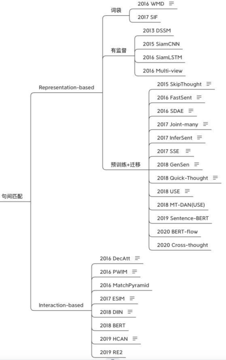
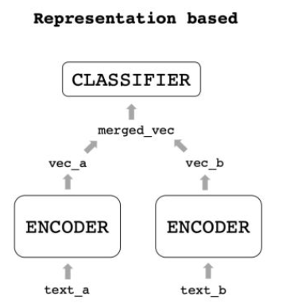
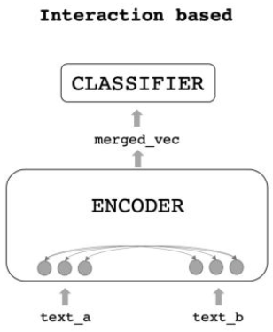
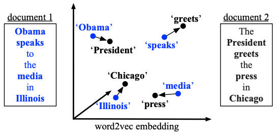
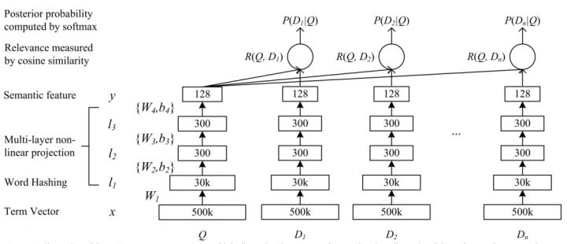
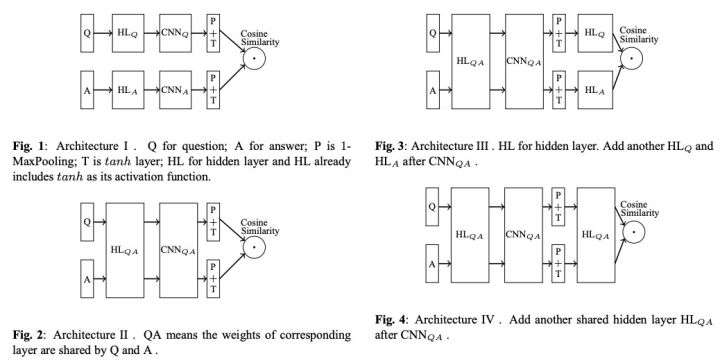
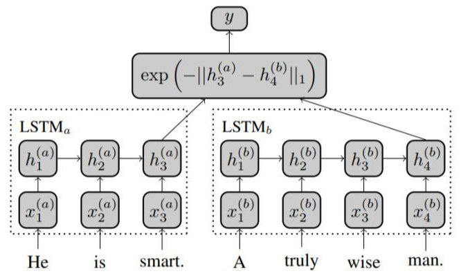
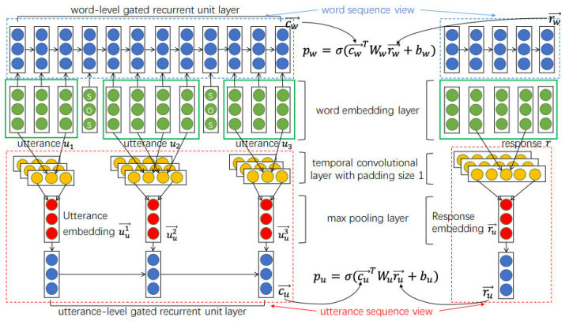
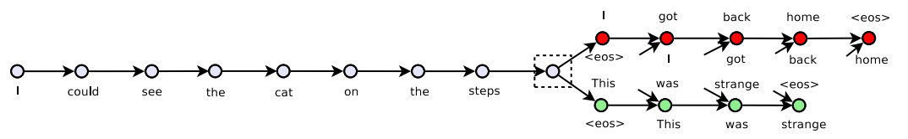
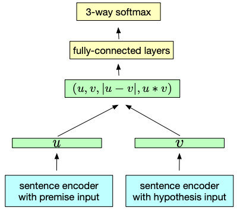

# 短文本匹配概述

定义：将两个句子送入模型，然后做一个二分类，判断2个句子是否相似。  
应用场景：
1. 问答
2. 信息检索

关键技术：模型通常不能很好的理解短文本的语义信息，因此往往需要“信息补充”，比如增加“上下文信息”（引入外部信息）。

常用模型架构：
1. 双塔式（也是下图中Representation-based）
2. 交互式（即下图中Interaction-based）

已有的模型：  

----
----
## 
简述两种架构
  
Auto-regeneration: enabled for 'e:/Zoe/zoeChen119.github.io'
### 1. 双塔式
定义：用2个Encoder分别编码2个input句子，得到2个向量，然后把2个向量merge合并，输入给一个浅层的分类器。  
  

### 2. 交互式
定义：用1个Encoder同时给2个input句子编码，在编码的过程中交互信息，输出一个合并信息后的向量，输入给分类器得到结果。  
  

> 对比：交互式能捕捉更多的信息，双塔式速度更快。  

比如线上来一个query，库里有一百万个候选，等交互式算完了用户都走了，但双塔式的候选可以提前计算好，只用给query编码后去和候选向量进行浅层计算就好了。工程落地的话，通常会用双塔式来做召回，把一百万个候选缩减为10个，再对这10个做更精细的计算。  

---
---

## 
细说两种架构
  

### 1. 双塔式
> 这里面通常有三个点可以优化：encoder、merged_vec、classifier，大部分研究都在专注提升encoder的能力。

encoder优化（在阶段①，词向量-->句向量）的发展分为以下3个阶段：
1. 词袋
2. 有监督
3. 预训练+迁移

我认为这里的“Encoder”就是语言模型LM,优化Encoder其实就是为了找到一个最精准、蕴含语义最丰富的语言模型来表征语句。
:star:或许不一定要蕴含语义最丰富的语义表征，最符合任务需要的或许更好呢？:star:

细分双塔式模型处理数据的流程：字/词向量-->句向量-->合并向量-->分类结果，而encoder优化即阶段①，词向量-->句向量。

#### 1.1 词袋法生成句向量
##### 1.1.1 SIF（加权平均）
会议：ICLR2017
方法：“smooth inverse frequency”，词向量加权平均得到句向量，再对多个句子组成的句向量矩阵进行PCA，让每个句向量减去第一主成分，去掉“公共”的部分，保留更多句子本身的特征。
效果：在相似度任务上有10%~30%的提升，甚至超过了一些RNN模型，同时速度很快
适用场景：适合速度要求高、doc相似度计算的场景。

##### 1.1.2 WMD（A New Metric）
会议：MLR2016
方法：提出一个新的“用句子之间距离来衡量相似度”方法（新的Metric）---Word Mover’s Distance：即句子A走到句子B的最短距离。  
下图为非停用词的向量转移总距离：
  
使用场景：不想用cosine相似度作为相似度衡量标准的时候

:musical_note:Trick：<u>更合适的词向量</u>：上面介绍的两篇文章使用的都是word2vec向量，但实际操作中我推荐使用fasttext（就是加上ngram，但仍用word2vec结构训练），一方面ngram可以增加信息，另一方面也避免了OOV。:musical_note:

#### 1.2 有监督方法生成句向量
词向量虽然可以经过简单处理（加权平均或者最短路径）变成句向量，但词袋式的融合也会丢失掉<u>顺序信息</u>，同时在训练时其目标还是word-level的，想要获得「真正的句向量」，还是需要寻找sentence-level的目标函数。

##### 1.2.1 DSSM
会议：CIKM2013
方法：这是一个多塔模型，它对文本进行word hash（也就是表示成ngram，减少词表数），再将ngram转成向量，再平均，得到句向量。
另外经过三层MLP得到128维的编码，再用cosine相似度作为每个Q-D对的分数，经过softmax归一化后得到P(D|Q)，最终的训练目标为最大化正样本被点击的概率。
  
效果：BOW式的词向量平均会损失上下文信息

##### 1.2.2 Siam-CNN
会议：未知[IBM 2015]
方法：使用CNN作为Encoder，pairwise loss作为损失函数，对比了各种双塔结构的形式。
  
效果：第二种是最好的。
> Ps：说实话这个结果有点迷，Query和Answer的表达还是略有不同的，经验上看我觉得第三个结构更靠谱些。不过作者只在一种数据集上进行了尝试，或许换个数据集结果会有变化。--李rumor

##### 1.2.3 Siam-LSTM
会议：AAAI2016
方法：用共享权重的LSTM作为Encoder，取最后一步的输出作为representation，使用曼哈顿距离计算损失。  

##### 1.2.4 Multi-View
会议：EMNLP2016
方法：针对多轮对话问题，提出了Multi-view的Q-A匹配方式，输入的query是历史对话的拼接，分别编码了word sequence view和utterance sequence view两种表示。词级别的计算和Siam-LSTM差不多，都是用RNN的最后一步输出做Q-A匹配，而句子级别的会对RNN每步输出做max pooling得到句子表示，然后再将句子表示输入到GRU中，取最后一步作为带上下文的表示与回答匹配  
效果：融合了两个level的匹配后比普通方法的R@1要好上4-6个点，提升很明显。
适用场景：多轮对话任务

#### 1.3 预训练+迁移
有监督、领域内的语料总是有限的，目前很多任务都开始转向预训练+迁移的范式。
##### 1.3.1 Skip-Thought
会议：NIPS2015
方法：无监督句向量训练方法，参考wrod2vec，一句话与它的上下文也是存在关联的，因此我们可以用一个句子的编码去预测它的上下句：
  用GRU作为Encoder，条件GRU作为Decoder，预测时候只用Encoder就可以得到句子Representation。
效果：无监督；这种方法训出的decoder不用比较浪费，后续也有学者用同样的思想改成了判别任务，比如Quick-Thought对句子分别编码，过分类器选择上下文，又或者BERT中的NSP，或者ALBERT的SOP。

##### 1.3.2 FastSent
会议：ACL2016
方法：在Skip-Thought基础上用词袋模型去替换RNN编码，再用中间句子的表示去预测上下文的词。又提出了一个FastSent+AE变体，预测目标也加上了自身的词。
效果：在无监督任务上好于Skip-Thought，但有监督任务上还是略逊色。

##### 1.3.3 :gem:InferSent
> 前几篇可迁移的encoder都是无监督的，因为学者们一直没有发现更通用的数据，直到InferSent。  

会议：EMNLP2017
方法：使用NLI数据集来预训练双塔结构,用了很简单的双塔结构，但在<u>计算loss时先对两个向量用了多种方式融合</u>，再过分类器。同时也提出了多个基于RNN、CNN的编码器，最后实验发现BiLSTM+Max效果最好，在评估的10个任务中有9个达到了SOTA。
  
效果:InferSent提出的结构到现在还用很多同学在用，包括后文的Sentence-BERT（19年的SOTA）也只是换了个编码器而已。同时用NLI来做预训练这个点也很重要，优质语料对模型提示有很大帮助。
> 后续也有模型进行了小改进，比如2017年的SSE，使用3层堆叠BiLSTM+Shortcut，效果比InferSent好一些。

##### 1.3.4 GenSen
会议：ICLR2018
方法：使用GRU编码，将encoder下游接上4种不同的任务（预测上下文、翻译、NLI、句法分析）
效果：提升可迁移性,只在6/10个任务上超越了之前的模型，个别情况下增加新的任务还会使效果下降。
> 这种多任务的思想后续也被用在其他模型上，比如MT-DNN（狗头。

##### 1.3.5 USE
会议:ACL2018
