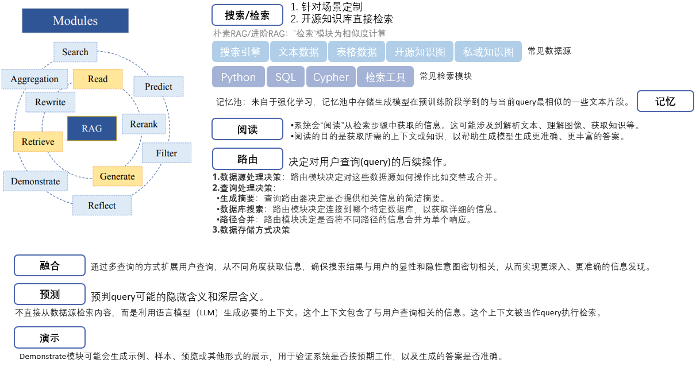
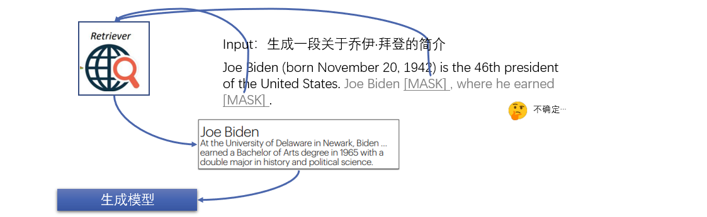
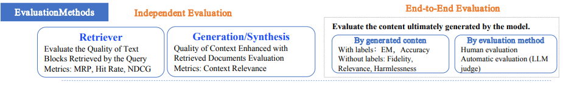

# RAG检索知识增强 不完全手册

本文从k个角度对RAG技术进行综述，第一个角度是“范式演变”，即原始的“朴素RAG”-“进阶RAG”-“模块化RAG”，这个角度个人认为是工程的角度、宏观的角度；第二个角度是“关键问题和相关研究”，大类上可分两类“以优化生成模型的表征空间为目的”和“以优化知识密集型问答任务为目的”。

通常“以优化生成模型的表征空间为目的”的这些模型有几个特点：（1）检索对象是token/chunk，即取input中的部分或全部token作为query触发检索器，（2）检索的时机是每生成1个token都要增强一下，这样才能达到优化整个表征空间的目的，（3）使用检索内容的方式既可以在输入层注入、在生成模型内部注入也可以在输出层注入。

通常“以优化知识密集型问答任务为目的”的这些模型有几个特点：（1）检索对象下至token-level上至段落-level，（2）检索的时机多为隔几个token或者遇见特定的token才会触发检索，因为它的目的不是优化表征空间，而是优化问答任务，(3）使用检索内容的方式往往不采用在生成模型内部注入的方法，因为这种模型往往不希望训练。

[1] 专补大模型短板的RAG有哪些新进展？这篇综述讲明白了https://mp.weixin.qq.com/s/yZo-HcGuWFQE8B63hZkqVQ

[2] 前沿重器[41] | 综述-面向大模型的检索增强生成（RAG）https://mp.weixin.qq.com/s/Ebc-DEpfEBNP1nrQHkQv4g

[3] OpenAI Sora、Prompt工程、RAG、表格处理、长文本、embedding等大模型进展总结分享回顾https://mp.weixin.qq.com/s/5nUKrTYSGrJhPMIXw6_35A

[4] 大模型如何可解释？帝国理工最新《大型语言模型的解释性》最新综述https://mp.weixin.qq.com/s/kW5qpJQQ74wo8LfiiGgeCA

[5] 大模型增量预训练新技巧-解决灾难性遗忘https://mp.weixin.qq.com/s/IoCxatkaDeYhfWVuCQKnJw

[6] 说说我对RAG技术的理解https://mp.weixin.qq.com/s/7FH7sqk3pc2hjH-bkGtHxg

[7] Transformer的无限之路：位置编码视角下的长度外推综述https://mp.weixin.qq.com/s/9SK8YuUzHr4ZOnFkQNQb6g

[8] TRL 正式推出，来训练你的首个 RLHF 模型吧！https://mp.weixin.qq.com/s/WSUs0ipdb2gKkNdQ60isRw

[9] 分享 || OpenAI 如何不通过 fine-tuning 将 **RAG** 的准确率由 45% 提升至 98%？https://mp.weixin.qq.com/s/B7VaDU02LIC5x_ww3zlb2A

[10] **RAG**的究极进化：知识图谱和向量检索结合https://mp.weixin.qq.com/s/Q-Dtq-sFgsJQI4r7C4lr4Q

[11] 简单提升**RAG**的10种方法https://mp.weixin.qq.com/s/bNyMMDkjPWOq_V1AqHqCBg

[12]【图文长文】探索**RAG**技术：从知识检索到答案生成的神奇过程解析https://mp.weixin.qq.com/s/qaEEMUxstAjVKml7VbfqFA

[13] **RAG**行业交流中发现的一些问题和改进方法https://mp.weixin.qq.com/s/BXP3g8El3jUF8VFjh3Ufzg

[14] ChatGPT应用：如何征服市场眼中的“万能**RAG**”https://mp.weixin.qq.com/s/4kwwBnpGvXbwNBatLqcghg

[15] Graph **RAG**: 知识图谱结合 LLM 的检索增强 - 知乎https://zhuanlan.zhihu.com/p/654008500

[16] **基于RAG构建生成式AI应用**最佳实践与“避坑指南”--亚马逊https://github.com/lizhe2004/Awesome-LLM-RAG-Application/blob/main/resource

[17] 爱可可 AI 前沿推介(8.10)https://mp.weixin.qq.com/s/VqjlUeji1PAsF9PEKy4oYQ

## 一、范式演变

[1]【RAG系列探索之旅·第四弹】RAG研究范式：从初级到高级的演变https://mp.weixin.qq.com/s/VHHmn2DDZ_ykSxdFNsK9vg

[2]【RAG系列探索之旅·第六弹】模块化RAG：重塑信息检索的未来https://mp.weixin.qq.com/s/FX4zs3GbIFIhtG4O3b6dNg

[3] 技术动态 | 模块化（Modular）RAG 和 RAG Flowhttps://mp.weixin.qq.com/s/Pdx8J_tCyYJ_bgFknc4UoA

[4] 也看大模型RAG长文本任务中的上下文精简与构造方式：兼看最近一周的大模型开源工作https://mp.weixin.qq.com/s/6RrFxfcj0w7jhPXk5mqEuw

### 1.1 Naive RAG

#### 局限性：

1. 检索——不够准确
   * 精度低：检索块错位
   * 召回率低：无法检索所有相关块
   * 信息过时：产生不准确的检索结果
2. 生成——幻觉、可控性差
   * 生成的答案不基于检索到的文档
   * 生成的答案与问题上下文不相关
   * 生成的答案存在潜在反事实错误或偏见
3. 增强——如何更好的融合外部文档
   * 多个检索段包含相似信息时，生成的响应中会出现重复内容
   * 多个检索段的重要性和相关性，对答案生成的价值需要平衡好
   * 模型过度依赖检索段的信息，导致输出的只是重复检索的内容，而不提供新的价值或合成信息

### 1.2 Advanced RAG

#### 1.2.1 Pre-Retrieval Process

优化检索器的输出质量：

* **数据清洗与更新**：删除不相关的信息，消除实体和术语中的歧义，确认事实的准确性，维护上下文，以及更新过时的文件。

* **优化文档结构**：调整块的大小以捕获相关上下文，跨多个索引路径进行查询，以及通过利用图数据索引中节点之间的关系来合并来自图结构的信息以捕获相关的上下文。

* **添加元数据信息**：将引用的元数据（如日期和目的）集成到块中以进行过滤，并合并引用的章节和小节等元数据以提高检索效率。

* **对齐优化**：对问题进行重写、路由和扩充。通过在文档中引入“假设问题”[Li et al.，2023d]来纠正对齐问题和差异，从而解决对齐问题和文档之间的差异。

#### 1.2.2 Post-Retrieval Process

从数据库中检索到有价值的上下文后，必须将其与查询合并，作为LLM的输入，同时解决上下文窗口限制带来的挑战。简单地将所有相关文档一次性呈现给LLM可能会超出上下文窗口限制，引入噪声，并阻碍对关键信息的关注。为了解决这些问题，需要对检索到的内容进行额外的处理。

* **重排序**：对检索到的信息重新排序以将最相关的内容重新定位到提示的边缘是一个关键策略，避免 “Lost in the Middle ” 现象的发生。
* **Prompt 压缩**：检索到的文档中的噪声会对RAG性能产生不利影响。在后处理中，重点在于压缩不相关的上下文，突出关键段落，减少整体上下文长度。

### 1.3 Modular RAG

部分模块介绍：

1. 记忆池模块

   在**检索增强生成（RAG）**中，记忆池和检索到的外部知识文档的区别。

   **记忆池**：

   ​	1.**定义**：记忆池是一个存储在模型内部的数据集合，用于引导模型的生成过程。

   ​	2.**数据来源**：记忆池中的数据通常来自于模型训练时使用的数据集，或者是与任务相关的其他文本片段。

   ​	3.**特点**：这些数据是模型已经学到的知识，存储在模型的权重中（参数记忆）。

   ​	4.**更新**：记忆池的数据通常不会频繁更新，因为它们是模型训练期间获取的。

   **检索到的外部知识文档**：

   ​	1.**定义**：这些文档是从外部知识源（例如向量数据库、专业领域的文章等）中检索到的数据。

   ​	2.**数据来源**：外部知识文档可能包含最新的、专有的、或特定领域的信息。

   ​	3.**特点**：这些文档不是模型训练期间学到的，而是从外部获取的，因此可能更准确、更具体。

   ​	4.**更新**：外部知识文档可以随时更新，而不会产生重大成本。

   总之，记忆池是模型已知的内部数据，而检索到的外部知识文档是从外部获取的数据。RAG通过结合这两者，使模型能够更准确地生成答案，并且可以利用最新的、来自外部的信息。

2. 融合模块

   通过多查询的方式扩展用户查询，从不同角度获取信息，确保搜索结果与用户的显性和隐性意图密切相关，从而实现更深入、更准确的信息发现。

   1. **RAG-Fusion**：这个方法通过多查询的方式扩展用户查询，从不同角度获取信息，利用**语言模型**（LLM）来揭示更深层次、变革性的知识。具体而言，它包括以下步骤：

      - **扩展查询**：将用户查询扩展为多个不同的视角，以获取更全面的信息。
      - **并行向量搜索**：同时对原始查询和扩展查询进行向量搜索，以获取相关文档。
      - **智能重新排序**：对搜索结果进行智能排序，以优化答案的质量。
      - **新查询匹配**：将最佳结果与新查询匹配，以满足用户的显性和隐性意图。

   2. **优势与挑战**：

      + 优势：

        - **实时更新**：RAG能够访问最新的外部信息，保持知识的时效性。
        - **减少幻觉**：通过使用外部验证信息，RAG有助于减少语言模型产生的错误或虚构信息。
        - **高透明度**：生成答案时引用外部信息源，增加可信度和可追溯性。

      + 挑战：
        - **外部依赖**：RAG的性能高度依赖于外部知识库的质量和覆盖范围。
        - **生成延迟**：检索过程可能增加回答生成的时间延迟。

3. 路由模块

   负责决定对用户查询的后续操作。

   1. **数据源处理决策**：RAG系统的检索过程利用了不同领域、不同语言和不同格式的多样化数据源。路由模块决定对这些数据源如何操作比如交替或合并。
   2. **查询处理决策**：
      - **摘要生成**：查询路由器决定是否提供相关信息的简洁摘要。
      - **数据库搜索**：路由模块决定连接到哪个特定数据库，以获取详细的信息。
      - **路径合并**：路由模块决定是否将不同路径的信息合并为单个响应。
   3. **数据存储方式决策**：查询路由器还会选择适当的数据存储方式，这可能包括各种来源，如向量存储、图数据库、关系数据库或索引层次结构，例如用于多文档存储的摘要索引和文档块向量索引。查询路由器的决策是预定义的，并通过语言模型（LLMs）调用来执行，从而将查询定向到选择的索引。

4. 预测模块

   不直接从数据源检索内容，而是利用语言模型（LLM）生成必要的上下文。这个上下文包含了与用户查询相关的信息。这个上下文被当作query执行检索。            

   好处：
   ​	1. 减少冗余：由LLM生成的内容更有可能包含相关信息，相比直接从数据源检索获得的内容更具相关性。因此，它可以减少重复的信息。
   ​ 	2. 降低噪音：通过使用LLM生成的上下文，预测模块可以过滤掉不相关或低质量的信息**，从而减少了检索结果中的噪音。

5. 适配器模块

   两个例子：

      UPRISE：这个模块自动从预先构建的数据池中检索用于零样本任务输入的提示。通过这种方式，它增强了任务和模型之间的通用性。UPRISE使得RAG能够适应不同任务的需求，而无需重新训练模型。
      PROMPTAGATOR：这个模块利用语言模型（LLM）作为少样本查询生成器。基于生成的数据，它创建了特定任务的检索器。通过充分利用LLMs的泛化能力，PROMPTAGATOR可以使用极少的示例开发特定任务的端到端检索器。

## 二、RAG的3大关键问题

**解决关键问题的方法其实是在优化RAG中的1或多个模块的方法。**

[1] Advanced RAG — Improving retrieval using Hypothetical Document Embeddings(HyDE):https://medium.aiplanet.com/advanced-rag-improving-retrieval-using-hypothetical-document-embeddings-hyde-1421a8ec075a

[2] 一文纵览LLM+RAG 的方法实现https://mp.weixin.qq.com/s/ifp2i71Psn86ZCEzffsF0Q

[3] 大模型检索增强生成（RAG）系统进化指南https://mp.weixin.qq.com/s/4Ttd3hi13B4VdoPGauwMzA

[4] ACL23 | 基于检索的大语言模型-陈丹琦报告阅读https://mp.weixin.qq.com/s/_rajDkg-T1a6R0MKlLSEXA

[5] RAG Survey - 三大组件https://mp.weixin.qq.com/s/W1E_qFajK6XJYRNzlriS6Q

[6] ACL 2023 Tutorial: Retrieval-based LMs and Applicationshttps://acl2023-retrieval-lm.github.io/

### 4.1 优化生成模型表征空间

每隔l个token触发1次检索，第t次生成是根据当前片段$window_t$以及其对应的最相似文档$R(window_t)$生成的。

##### ① RETRO

RETRO模型是每隔l个token触发一次检索，检索器的输入q是当前的上下文片段，然后根据q检索出k个最相似的文档片段，作为检索器的输出retriever(q)。然后，第t次生成的输出yt是由语言模型LM根据q和retriever(q)的联合表示来预测的。也就是说，yt=RETRO-block(qt,retriever(qt)\]是RETRO模型的生成公式。

`公式`

##### ② IC-RALM

算是一种适应性检索。

> Since common Transformer-based LM implementations support limited length input sequences, when the concatenation of the document and the input sequence exceed this limit we remove tokens from the beginning of x until the overall input length equals that allowed by the model. Because our retrieved documents are passages of limited length, we always have enough context left from x.

[IC-RALM是一种检索增强语言模型，它使用一个可训练的检索器来动态地调整检索到的文档的权重，以适应不同的任务](https://zhuanlan.zhihu.com/p/674085535)[1](https://zhuanlan.zhihu.com/p/674085535)。它的主要思想是将检索到的文档作为上下文，与当前的生成状态一起输入到语言模型中，从而提高生成的质量和多样性。它的主要优点是**可以根据任务的需求，自动选择最相关的文档，并且可以处理多个文档的组合**。它的主要缺点是需要对检索器和语言模型进行联合训练，这会增加计算成本和复杂性。

IC-RALM的工作流程如下：

- 首先，给定一个输入序列，例如一个问题或一个部分生成的文本，检索器会从一个大型的文档集合中检索出k个最相关的文档。检索器可以是任何基于向量的检索方法，例如BM25、DPR或ColBERT。
- 然后，**检索器会为每个检索到的文档分配一个权重，表示它对当前输入的重要性**。**权重是通过一个可训练的神经网络计算的**，该网络接收检索到的文档和输入序列的嵌入作为输入，并输出一个标量值。权重可以被视为一个注意力机制，用于选择最相关的文档。
- 接下来，检索到的文档和输入序列被拼接在一起，形成一个新的输入序列，用于语言模型的生成。语言模型可以是任何基于Transformer的自回归模型，例如GPT-2或GPT-3。语言模型会根据检索到的文档和输入序列生成下一个标记，从而实现文本生成或问答等任务。
- 最后，**检索器和语言模型会通过反向传播进行联合训练，以最小化生成标记的交叉熵损失。**这样，检索器可以学习如何为不同的任务选择最合适的文档，而语言模型可以学习如何利用检索到的文档进行更好的生成。

##### ③ KNNLM

KNN-LM在生成模型根据上文生成下一个token的时候，将上文的向量表征和训练集中的所有上文的表征进行knn计算，得到最相近的k个上文各自的下一个token，归一化，和原来的下一个token计算，得到一个更优的下一个token。

每个token检索1次。

##### ④ REPLUG

[1] 论文分享 | arXiv-23 | REPLUG：检索增强黑盒语言模型https://mp.weixin.qq.com/s/cS3eTDSO1oDs8hSxMkTjvw

[2] 一文详解检索增强语言模型新范式REPLUGhttps://mp.weixin.qq.com/s/kULpBme-NSYmOw4RLboyGQ

[3] REPLUG: Retrieval-Augmented Black-Box Language Modelshttps://readpaper.com/pdf-annotate/note?pdfId=4762336033991819265

[4] 大模型RAG中embedding的两个新进展BGE-M3及MRL：兼看几个有趣的综述及水印工作https://mp.weixin.qq.com/s/NJNnyfNaeVNjO1GnJ46T1g

[5] 微软放大招：基于RAG与Fine-Tuning的数据整合策略探索https://mp.weixin.qq.com/s/oeQnMGmGMT0R8x3h35weqg

### 4.2 优化知识密集型问答任务

每个句子触发1次检索，用前1个句子作为$q$，$q_{t-1}$和$R(q_{t-1})$生成$y_t$。

#### ① REALM

#### ② IRCoT

[1] 「think step by step」还不够，让模型「think more steps」更有用https://mp.weixin.qq.com/s/UgglOk-u6Qv3IrY6aWcarQ

[2] In-Context Learning玩法大全https://mp.weixin.qq.com/s/NLWCuzcCdwljQfzu-Jd9lQ

> 问题分解方法是手动注释特定任务的示例，以指导LMs在生成输出的同时生成分解的子问题。

#### ③ Self-Ask

实验结果：

GPT3：Davinci-002

上表显示了Bamb&2wikimultihop&musique三个数据集的**Accuracy**指标，Bamb是作者人工判断的，剩下两个是“完全匹配”。

上表显示了和Least-to-Most模型的对比，toks指生成的回答的长度。

#### ④ Least-to-Most

第一阶段：先“问”模型回答问题首先需要知道什么

第二阶段：引导模型先生成子问题的回答，然后将子问题及其回答作为instruction补充在input中，引导模型生成最后的回答

[1] 如何使用快速压缩将RAG的Prompt成本削减80%https://mp.weixin.qq.com/s/7j1eTqD3DnRH-o2ZjREuPg

#### ⑤ FLARE

[1] Active RAG -- FLARE 详解https://mp.weixin.qq.com/s/YTxOjwjNvyhrUtVtmQ-rRQ

[2] logprobs-OpenAI fine tune数据集准备最佳实践https://mp.weixin.qq.com/s/S9t7gw55MIaCGY60iaso7Q

#### ⑤ Self-RAG

[1] 也看引入自我反思的大模型RAG检索增强生成框架：SELF-RAG的数据构造及基本实现思路https://mp.weixin.qq.com/s/VyrkSnYb4Uss8cfZp1yrvA

### 4.4 RAG的评估方法

#### A.评估方式

**① NDCG**（Normalized Discounted Cumulative Gain，归一化折损累计增益）是一种用于评估排序结果的指标。在搜索和推荐任务中，系统常常返回一个项目列表。NDCG的目的是衡量这个返回的列表的质量。原理如下：

1. **Gain（增益）**：表示一个列表中所有项目的相关性分数。`rel(i)` 表示第 `i` 个项目的相关性得分。
2. **Cumulative Gain（累积增益）**：对前 `k` 个项目的 Gain 进行累加。$CG_k = \sum_{i=1}^{k} rel(i)$
3. **Discounted Cumulative Gain（折损累计增益）**：考虑了排序顺序的因素，使得排名靠前的项目增益更高，对排名靠后的项目进行折损。DCG 的计算公式为：$DCG_k = \sum_{i=1}^{k} \frac{rel(i)}{\log_2(i+1)}$。其中，`i` 表示项目的排名，`rel(i)` 是项目的相关性得分。
4. **Ideal DCG（理想的 DCG）**：根据相关性降序排列的最佳状态，即排列到最好的状态。IDCG 是 DCG 的理想值，它是一个参考点。
5. **Normalized DCG（归一化折损累计增益）**：用 DCG 除以 IDCG 来表示，这样可以将 DCG 归一化到 [0, 1] 范围内。NDCG 的计算公式为：$NDCG = \frac{DCG}{IDCG}$。

通过 NDCG，我们可以在不受不同查询结果数量的影响的前提下相对地评估不同查询或推荐结果的质量。

② **MRR**，该指标越大越好（即预测排名越靠前，倒数就越大，求和结果越大越好）

$\text{MRR} = \frac{1}{Q} \sum_{i=1}^{|Q|} \frac{1}{\text{rank}_i}$

RAG 的评估方法多样，主要包括三个质量评分：**上下文相关性、答案忠实性和答案相关性**。此外，评估还涉及四个关键能力：噪声鲁棒性、拒答能力、信息整合和反事实鲁棒性。这些评估维度结合了传统量化指标和针对 RAG 特性的专门评估标准，尽管这些标准尚未统一。

* 忠实度：衡量生成的答案与给定上下文的事实一致性。

$\text{忠实度} = \frac{\text{句子中的基本事实可以从上下文中推断出的句子数量}}{\text{生成回答的句子总数}}$

* 答案相关性：评估生成的答案与用户问题之间的相关程度。

​    思想：如果生成的答案准确地解决了最初的问题，LLM应该能够从答案中生成与原始问题相符的问题。

​    做法：为了计算这个分数，LLM会被提示多次为生成的答案生成适当的问题，并测量这些生成的问题与原始问题之间的平均余弦相似度。

$score_{AR} = \frac{\sum_{i=0}^{k-1} \text{cos_sim} (Q, q'_{i})}{k} $

$q'=LLM(answer)$

$Answer Relevance = \sum_{i=0}^{k-1} \text{cos_sim} (Question, LLM(answer)_{i})$

* 上下文相关性：评估检索到的上下文的相关性。

  准确率：检索到的context中与query相关的句子数量/检索到的context的句子总数

​     理想情况下，检索到的Context应只包含解答question的信息。 我们首先通过识别检索到的Context中与回答question相关的句子数量来估计 |S| 的值。 最终分数由以下公式确定：

$\text{上下文相关性} = \frac{\text{检索到的上下文中与真实答案相关的句子数量}}{\text{真实答案中的句子总数}}$

在评估框架方面，存在如 RGB 和 RECALL 这样的基准测试，以及 RAGAS、ARES 和 TruLens 等自动化评估工具，它们有助于全面衡量 RAG 模型的表现。表中汇总了如何将传统量化指标应用于 RAG 评估以及各种 RAG 评估框架的评估内容，包括评估的对象、维度和指标，为深入理解 RAG 模型的性能和潜在应用提供了宝贵信息。

$score_{EM}$

 

搜索推荐评价指标Precision@k、Recall@k、F1@k、NDCG@k_precision@5-CSDN博客https://blog.csdn.net/guolindonggld/article/details/121114309

NDCG 归一化折损累计增益的动机、讲解、公式、实现 - 知乎https://zhuanlan.zhihu.com/p/474423793

Advanced RAG Techniques: an Illustrated Overview | by IVAN ILIN | Towards AIhttps://pub.towardsai.net/advanced-rag-techniques-an-illustrated-overview-04d193d8fec6

【RAG系列探索之旅·第十弹】RAG评估全攻略：方法、指标与框架https://mp.weixin.qq.com/s/EJteC2assR-mGoEv-n5Q_w

05细说RAG评估指标https://mp.weixin.qq.com/s/jVs2S4O8Sd_AtzEWdFRjoQ

再看大模型RAG检索增强如何评估：RAGAS开源自动化评估框架https://mp.weixin.qq.com/s/TrXWXkQIYTVsS1o4IZjs9w

大模型RAG检索增强问答如何评估：噪声、拒答、反事实、信息整合四大能力评测任务探索https://mp.weixin.qq.com/s/YFji1s2yT8MTrO3z9_aI_w

如何评估 RAG 应用的质量？最典型的方法论和评估工具都在这里了https://mp.weixin.qq.com/s/OnfSxBJx_lVYV_MtyViUMw

LLM之RAG实战（二十七）| 如何评估RAG系统https://mp.weixin.qq.com/s/4EcYxBpPLMrbACy3aSyOyQ

科普贴：一文说透RAG的方方面面https://mp.weixin.qq.com/s/mrnU3DLbGsumJ7mOjosh8g
RAG 评估框架 -- RAGAShttps://mp.weixin.qq.com/s/MPUPbyjuIVhw1wM3l0P1aA
NDCG - 知乎https://zhuanlan.zhihu.com/p/371432647

高级RAG(四)：Ragas评估 - - 派神 -的文章 - 知乎https://zhuanlan.zhihu.com/p/675777378

学习检索增强生成(RAG)技术，看这篇就够了——热门RAG文章摘译(9篇) - 吕阿华的文章 - 知乎https://zhuanlan.zhihu.com/p/673392898

🚀 Get Started | Ragashttps://docs.ragas.io/en/latest/getstarted/index.html

RAG 评估框架 -- ARES - 知乎https://zhuanlan.zhihu.com/p/677767672

Evaluating Naive RAG and Advanced RAG pipeline using langchain v.0.1.0 and RAGAS | by Plaban Nayak | Feb, 2024 | AI Planethttps://medium.aiplanet.com/evaluating-naive-rag-and-advanced-rag-pipeline-using-langchain-v-0-1-0-and-ragas-17d24e74e5cf

openai-cookbook/examples/evaluation/Evaluate_RAG_with_LlamaIndex.ipynb at main · openai/openai-cookbookhttps://github.com/openai/openai-cookbook/blob/main/examples/evaluation/Evaluate_RAG_with_LlamaIndex.ipynb

也看大模型的选择题评估方式是否鲁棒：兼看RAG知识增强问答中的知识冲突和评测基准https://mp.weixin.qq.com/s/LYJcqvWsqnTkQcFnPd2WKg

https://arxiv.org/pdf/2309.15217.pdf

## RAG的未来展望

Gemini 1.5 Pro | 快速工程指南https://www.promptingguide.ai/models/gemini-pro

谷歌10M上下文窗口正在杀死RAG？被Sora夺走风头的Gemini被低估了？https://mp.weixin.qq.com/s/t3fsKksf7DWwVJY5vldPNw

LLM长上下文时代，RAG的机遇与挑战https://mp.weixin.qq.com/s/LhwWE6t_muigcLbXAAKQ_w

负拒绝问题：

首先，什么问题需要LLM拒绝回答？1. 本身不具备的知识拒绝回答，2. 上下文中提供的信息仍然不包含回答问题必要的信息时拒绝回答，3. 上下文中提供的信息包含反事实错误时识别出来并拒绝回答。

针对第一种问题可以采用置信度的策略，针对模型的直接回答中提取置信度低的token的个数，当数量超过总token的30%（此阈值可调参）视为LLM无法回答问题，给出拒绝回答。

- [使用拒绝采样（Rejection Sampling）技术，让LLM在生成答案之后，对答案进行评估，如果评估得分低于某个阈值，就拒绝输出该答案，或者重新生成一个新的答案](https://www.zhihu.com/question/600531471)[4](https://www.zhihu.com/question/600531471)[5](https://zhuanlan.zhihu.com/p/683702878)。
- [使用自我评估（Self-Evaluation）技术，让LLM在生成答案之后，对答案进行自我检查，如果发现答案与问题不匹配，或者包含错误或不确定的信息，就拒绝输出该答案，或者给出一个带有免责声明的答案](https://zhuanlan.zhihu.com/p/676939361)[6](https://zhuanlan.zhihu.com/p/676939361)[7](https://zhuanlan.zhihu.com/p/666278645)