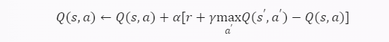
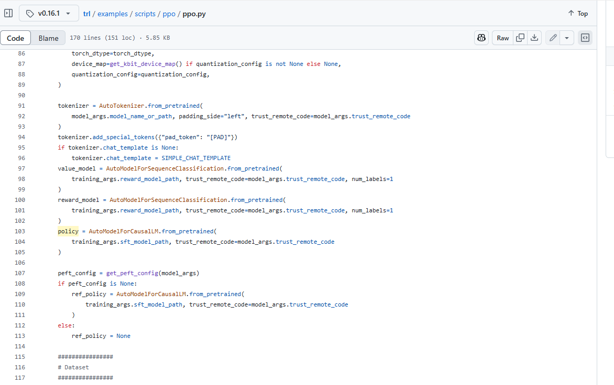

# 

## 0 一些共识

1. 基本的NLP任务label是人工或自动标注的，这种既定的答案（又称为监督目标字符串）我们认为是“没有人类偏好的直接信号”，但语言技术的最终目标是与人类互动。因此这样的label其实是不太合理的。

   > The ultimate aim of language technology is to interact with humans. However, most language models are trained without direct signals of human preference, with supervised target strings serving as (a sometimes crude) proxy.

## 1 强化学习基础知识

### 1.0. 马尔可夫决策过程

马尔可夫决策过程（MDP）是**一种用于对具有随机性和部分可控性的决策问题进行建模的数学框架**。

MDP的**核心特征**是具有马尔可夫性质，即下一个状态只依赖于当前的状态和动作，而与之前的历史无关。

MDP的**目标**是找到一个最优的策略，即在每个状态下选择一个最优的动作，使得决策者从初始状态到终止状态的累积奖励最大化。

MDP可以用一个**四元组（S，A，P，R）**来表示，其中S是状态集合，A是动作集合，P是状态转移概率，R是奖励函数。

> PS.
>
> 马尔可夫性质：下一个状态只依赖于当前的状态和动作，而与之前的历史无关。
>
> 马尔可夫模型：具有马尔可夫性质的随机过程的数学模型。
>
> 马尔可夫模型分两类①马尔科夫链；②隐马尔科夫模型
>
> 马尔可夫链【二元组（S，P）】：一种**状态和状态转移概率都是可观测**的马尔可夫模型。
>
> 隐马尔可夫模型【五元组（ S , O , π , A , B ) 】：一种**状态是不可观测的，只能通过输出来推断**的马尔可夫模型。
>
> 马尔可夫决策过程【四元组（S，A，P，R）】：是马尔可夫链的推广，不同之处在于添加了动作（允许选择）和奖励（给予动机）。
>
> 
>
> 其中
>
> - S是状态空间的集合，表示决策者可能处于的所有状态。
> - A是动作空间的集合，表示决策者在每个状态下可以采取的所有动作。
> - P是状态转移概率函数，表示在当前状态下采取某个动作后，下一个状态的概率分布。通常表示为 P(s’|s,a)，其中 s’表示下一个状态，s表示当前状态，a表示采取的动作。
> - R是奖励函数，表示在当前状态下采取某个动作后，决策者能够获得的即时奖励。通常表示为 R(s,a)，其中 s表示当前状态，a表示采取的动作。
> - 初始状态概率向量 π，表示初始时刻处于每个状态的概率。
>
> 
>
> 马尔科夫链 V.S 马尔可夫决策过程
>
> 马尔可夫决策过程是一种特殊的马尔可夫模型，它属于马尔可夫链的一种，但是比马尔可夫链更复杂，因为它涉及到决策和优化的问题。
>
> 马尔可夫链的<u>目标是分析状态的长期行为</u>，例如平稳分布，吸收概率，平均回报时间等。[马尔可夫决策过程的目标是为决策者找到一个好的“策略”：一个函数 ，它指定决策者在状态 时将选择的动作 。这样，决策者可以在每个状态下选择一个最优的动作，使得从初始状态到终止状态的累积奖励最大化。](https://zh.wikipedia.org/zh-cn/馬可夫決策過程)

关于初始状态为什么有的版本写的有有的无：

> 初始状态概率向量是指在初始时刻，系统处于每个状态的概率分布。它是描述随机过程的一个重要参数，但并不是必须的。（1）有些随机过程的初始状态是确定的，比如说从某个特定的状态开始，那么初始状态概率向量**就是一个只有一个非零元素的向量**。（2）有些随机过程的初始状态是不确定的，但是随着时间的推移，系统会收敛到一个平稳分布，那么初始状态概率向量就**不会影响系统的长期行为**。（3）有些随机过程的初始状态是不确定的，而且会影响系统的长期行为，那么初始状态概率向量**就是一个需要考虑的参数**。
>
> 马尔可夫决策过程和马尔可夫链的表示中没有初始状态概率向量，是因为它们通常假设初始状态是给定的，或者不影响系统的最优策略或长期行为。马尔可夫决策过程的目标是找到一个最优的策略，即在每个状态下选择一个最优的动作，使得决策者从初始状态到终止状态的累积奖励最大化。**如果初始状态是确定的，那么初始状态概率向量就是多余的。如果初始状态是不确定的，但是最优策略是独立于初始状态的，那么初始状态概率向量就是无关的。**马尔可夫链的目标是分析状态的长期行为，例如平稳分布，吸收概率，平均回报时间等。**如果马尔可夫链是遍历的，即从任何状态都可以到达任何其他状态，那么初始状态概率向量就不会影响平稳分布**。**如果马尔可夫链是不遍历的，但是我们只关心吸收状态的性质，那么初始状态概率向量就不会影响吸收概率或平均回报时间**。
>
> 当然，并不是说初始状态概率向量在马尔可夫决策过程和马尔可夫链中没有用处。**有时候，我们可能需要考虑初始状态的不确定性或影响，那么初始状态概率向量就是一个重要的参数。例如，如果我们想要计算马尔可夫决策过程的平均累积奖励，或者马尔可夫链的平均转移次数，那么初始状态概率向量就是一个必要的输入。**在这些情况下，我们可以将初始状态概率向量作为马尔可夫决策过程或马尔可夫链的表示的一部分，或者单独给出。

### 1.1. 马尔可夫模型→强化学习

传统强化学习的硬编码规则是指智能体（agent）在每个状态（state）下应该采取的最优动作（action），这些规则通常是通过数学公式或者程序代码来表示的。传统强化学习的环境特征是指环境（environment）的状态集合（state space）、动作集合（action space）、状态转移概率（transition probability）和奖励函数（reward function），这些特征通常是通过矩阵或者向量来表示的。

具体来说，传统强化学习的目标是找到一个最优的策略（policy），即在每个状态下选择一个最优的动作，使得智能体从初始状态到终止状态的累积奖励（cumulative reward）最大化。为了找到这样的策略，传统强化学习需要知道或者估计环境的状态转移概率和奖励函数，以及智能体的状态和动作的范围，这就需要提供硬编码规则和环境特征。传统强化学习需要人工给定以下几个要素：

- 状态集合 S，表示智能体可能处于的所有状态。
- 动作集合 A，表示智能体在每个状态下可以采取的所有动作。
- 状态转移概率 P，表示在当前状态下采取某个动作后，下一个状态的概率分布。
- 奖励函数 R，表示在当前状态下采取某个动作后，智能体能够获得的即时奖励。

其中，状态集合 S 和动作集合 A 是由问题本身决定的，通常不需要人工制定。状态转移概率 P 和奖励函数 R 是由环境的特性决定的，通常需要人工给出或者估计。状态转移概率 P 描述了环境的动态性，奖励函数 R 描述了环境的反馈性。这两个要素是传统强化学习的硬编码规则，它们决定了智能体的学习目标和学习效果。

奖励函数 R 可以看作是一种奖惩机制，它可以通过正向奖励或者负向奖励来激励或者抑制智能体的行为。设计奖励函数是强化学习中的一个重要而困难的任务，它需要考虑如何平衡稀疏奖励和密集奖励，如何平衡探索和利用，如何平衡短期利益和长期利益，如何引入特定领域的知识等。奖励函数的设计往往需要人工的经验和创造力，也可能需要不断的调整和优化。

[强化学习（Reinforcement Learning）笔记——奖励和策略结构 - 知乎 (zhihu.com)](https://zhuanlan.zhihu.com/p/158457613)

以Q-learning为例：

Q-Learning中的S、A、P、R分别是：

- S是状态空间的集合，表示智能体可能处于的所有状态。
- A是动作空间的集合，表示智能体在每个状态下可以采取的所有动作。
- P是状态转移概率函数，表示在当前状态下采取某个动作后，下一个状态的概率分布。通常表示为 P(s’|s,a)，其中 s’表示下一个状态，s表示当前状态，a表示采取的动作。
- R是奖励函数，表示在当前状态下采取某个动作后，智能体能够获得的即时奖励。通常表示为 R(s,a)，其中 s表示当前状态，a表示采取的动作。

Q-Learning的核心是学习一个Q值函数，表示在每个状态下采取每个动作的长期回报的期望。Q值函数可以用一个表格来表示，也可以用一个函数近似器来表示。Q-Learning的更新公式是：

其中 α 是学习率，γ 是折扣因子，r 是即时奖励，$max_{a′}Q(s′,a′) $是下一个状态的最大Q值。

https://mp.weixin.qq.com/s/e4lw9X_hlPopIvreMYCaFw

### 1.2. RL in NLP

强化学习在NLP中应用面临的四大挑战：

1. **动作空间过大的问题**

   在强化学习中，智能体需要从一个非常庞大的动作集合中选择一个最优的动作，这会导致探索和利用的困难，以及训练的不稳定和低效。这个问题在NLP中也是存在的，在NLP中，RL的动作空间一般指的是在特定的语言任务中，智能体可以生成的所有可能的语言序列的集合。比如在文本生成任务中，动作空间就是所有可能的文本句子或段落的集合。在对话系统任务中，动作空间就是所有可能的对话回应的集合。在NLP中，动作空间的大小和复杂度往往取决于语言的规模，多样性，语法，语义等因素。因此，NLP中的动作空间通常是非常大的，甚至是无穷的，这就给强化学习的探索和利用带来了巨大的挑战。

2. **什么样的奖励函数能更好的衡量语言的质量和效果？**

   [奖励函数是强化学习的核心，它决定了智能体的学习目标和反馈。但是，在NLP中，设计一个合适的奖励函数并不容易，因为语言的质量和效果往往是主观和多样的，而且很难用一个简单的数值来衡量。例如，对于文本生成任务，常用的评价指标如BLEU，ROUGE等，可能不能完全反映人类的偏好和期望，而且可能存在一些不一致和不可比较的问题](https://arxiv.org/abs/2104.05565)[1](https://arxiv.org/abs/2104.05565)[2](https://www.zhihu.com/question/47548097)。因此，如何设计一个能够捕捉语言的复杂性和多样性的奖励函数，是一个重要而困难的任务。

3. 如何建模语言环境呢？

   [环境是强化学习的另一个关键要素，它决定了智能体的观察和状态转移。但是，在NLP中，建模一个合理的环境也不是一件容易的事，因为语言的环境往往是动态和不确定的，而且很难用一个简单的模型来描述。例如，对于对话系统任务，环境包括了对话伙伴的行为，情绪，反应等，这些都是难以预测和控制的，而且可能会随着时间和场景的变化而变化](https://link.springer.com/article/10.1007/s10462-022-10205-5)[3](https://link.springer.com/article/10.1007/s10462-022-10205-5)[4](https://doi.org/10.48550/arXiv.2104.05565)。因此，如何建模一个能够反映语言的动态性和不确定性的环境，是一个有趣而挑战的任务。

4. 如何获得适合RL训练的高质量数据？

   [在NLP中，获取足够的数据也是一件不容易的事，因为语言的数据往往是稀疏和有噪声的，而且很难用一个统一的标准来标注和评估。例如，对于文本摘要任务，数据的来源可能是多种多样的，如新闻，论文，评论等，这些数据的风格，内容，长度等都可能有很大的差异，而且可能存在一些错误，歧义，重复等问题](https://doi.org/10.1007/s10462-022-10205-5)[5](https://doi.org/10.1007/s10462-022-10205-5) 。因此，如何获取一个能够覆盖语言的稀疏性和有噪声性的数据，是一个实用而重要的任务。

## 2 Is Reinforcement Learning (Not) for Natural Language Processing?: Benchmarks, Baselines, and Building Blocks for Natural Language Policy Optimization

> We tackle the problem of aligning pre-trained large language models (LMs) with human preferences. If we view text generation as a sequential decision-making problem, reinforcement learning (RL) appears to be a natural conceptual framework. However, using RL for LM-based generation faces empirical challenges, including training instability due to the combinatorial action space, as well as a lack of opensource libraries and benchmarks customized for LM alignment. Thus, a question rises in the research community: is RL a practical paradigm for NLP?To help answer this, we first introduce an open-source modular library, RL4LMs1,2for optimizing language generators with RL. The library consists of on-policy RL algorithms that can be used to train any encoder or encoder-decoder LM in the HuggingFace library (Wolf et al., 2020) with an arbitrary reward function. Next, we present the GRUE (General Reinforced-language Understanding Evaluation)benchmark, a set of 6 language generation tasks which are supervised not by target strings, but by reward functions which capture automated measures of human preference. GRUE is the first leaderboard-style evaluation of RL algorithms for NLP tasks. Finally, we introduce an easy-to-use, performant RL algorithm, NLPO(Natural Language Policy Optimization) that learns to effectively reduce the combinatorial action space in language generation. We show 1) that RL techniques are generally better than supervised methods at aligning LMs to human preferences; and 2) that NLPO exhibits greater stability and performance than previous policy gradient methods (e.g., PPO (Schulman et al., 2017)), based on both automatic and human evaluations.

**如果我们将文本生成视为顺序决策问题**，强化学习 (RL) 似乎是一个自然的概念框架。然而，使用基于 LM 的生成使得用 RL 面临着经验挑战，包括**由于组合动作空间而导致的训练不稳定性**，以及**缺乏为 LM 对齐定制的开源库和基准**。因此，研究界一个问题上升：**RL 是 NLP 的实用范式吗？**

> 
>
> 这句话的意思是，如果我们把文本生成看作是一个需要在每个时间步选择一个词或符号的问题，那么强化学习就是一个合适的方法，因为它可以通过不断地与环境交互，学习一个最优的策略，使得生成的文本能够达到某种目标或标准。
>
> 例如，如果我们想要生成一首诗，我们可以用强化学习来训练一个模型，让它在每个时间步根据已经生成的内容和给定的主题，选择一个词或符号，直到生成完整的诗句。我们可以用一些评价指标，如韵律、押韵、情感等，来给生成的诗句打分，作为强化学习的奖励信号，从而指导模型的学习过程。
>
> - [**由于组合动作空间而导致的训练不稳定性**：在语言生成的过程中，每个时间步都需要从一个非常大的词汇表中选择一个词或符号，这就构成了一个组合动作空间。这个空间的大小随着时间步的增加而指数增长，导致训练过程变得非常复杂和不稳定。RL算法很难在这样的空间中找到最优的策略，而且容易受到噪声、过拟合、梯度消失等问题的影响](https://hub.baai.ac.cn/view/23432)[1](https://hub.baai.ac.cn/view/23432)[2](https://zhuanlan.zhihu.com/p/670227803)[3](https://hub.baai.ac.cn/view/22015)。
> - [**缺乏为 LM 对齐定制的开源库和基准**：为了使用 RL 来优化 LM 的输出，需要有一些工具和评估方法来支持这个过程。例如，需要有一些开源的库来提供各种 RL 算法和奖励函数，以及一些基准测试来衡量和比较不同的方法在各种语言生成任务上的表现。然而，目前这方面的资源还很缺乏，导致研究人员难以进行有效的实验和分析](https://zhuanlan.zhihu.com/p/638234382)[4](https://zhuanlan.zhihu.com/p/638234382)[5](https://zhuanlan.zhihu.com/p/419924345)。

首先使用开源模块化库RL4LM：使用 RL 优化语言生成器。

> 该库由策略强化学习算法组成，可用于训练HuggingFace库(Wolf et al.， 2020)中具有任意奖励函数的任何编码器或编码器-解码器LM。

 **GRUE（通用强化语言理解评估）基准**：这是一组 6 个语言生成任务，这些任务不是由目标字符串监督的，而是通过捕获人类偏好自动化度量的奖励函数。GRUE 是 NLP 任务的 RL 算法的第一个排行榜式评估。

最后，引入了一种易于使用、高性能的 RL 算法 **NLPO（自然语言策略优化）**，它学习有效地减少语言生成中的组合动作空间。

结论：

 1）RL 技术通常优于将 LM 与人类偏好对齐的监督方法；

 2）基于自动和人工评估，NLPO 表现出比先前策略梯度方法（例如 PPO (Schulman et al., 2017)）更大的稳定性和性能。

### Introduction

1. human-in-the-loop：用户将被期望为模型训练时的每个在线样本提供反馈，但这种程度的密集监督通常是令人望而却步且效率低下的。

2. models of human preference：人类偏好模型相比于传统的BLEU、METEOR显著提高了与人类判断的相关性。

   1. pairwise learned preference models
   2. BERTScore
   3. BLEURT

   缺点：这些函数通常不是per-token可微分——这方面同人类一样，只能对整体生成结果进行质量估计。这些指标不能直接用于**训练**语言模型，所以需要使用强化学习来优化语言模型的生成策略。

3. 将基于语言模型的生成（LM-based generation）视为一个序列决策问题（sequential decision-making problem）：强化学习（RL）为优化不可微分的标量目标（non-differentiable, scalar objectives）提供了一种自然的途径，当我们将基于语言模型的生成（LM-based generation）视为一个序列决策问题（sequential decision-making problem）时，就可以使用RL来训练语言模型，使其与人类偏好对齐。

> However, Goodhart's Law3 looms: particularly in the case of imperfect metrics that use neural networks, it is easy to find nonsense samples that achieve high-quality estimates.

[Goodhart’s Law](https://arxiv.org/pdf/2210.01241.pdf)[2](https://arxiv.org/pdf/2210.01241.pdf) 是一个经济学的法则，它可以简单地表述为：当一个指标成为目标时，它就不再是一个好的指标。换句话说，当我们设定一个特定的目标时，人们会倾向于为了达到这个目标而忽略其他的后果。这会导致问题，当我们忽视了一个情况的其他同样重要的方面时。

在使用神经网络的不完美的指标（imperfect metrics that use neural networks）的情况下，这个法则尤其突出：很容易找到一些无意义的样本（nonsense samples），它们可以获得高质量的评估（high-quality estimates）。这意味着，这些指标不能真实地反映生成文本的质量，而是容易被欺骗或操纵。

例如，如果我们使用[BLEURT](https://bair.berkeley.edu/blog/2021/11/08/similarity/) 这样的指标来评估生成文本的质量，它是一个基于 [BERT](https://datascience.stackexchange.com/questions/26854/what-are-useful-evaluation-metrics-used-in-machine-learning) 的神经网络模型，它可以计算生成文本和参考文本之间的语义相似度。但是，这个指标并不完美，它可能会给一些无意义或错误的文本高分，只要它们在表面上看起来和参考文本相似。

最近的一些研究 (Wu et al., 2021a; Ouyang et al., 2022)在使用强化学习（RL）来训练语言模型（LMs），使其与人类偏好（human preferences）对齐方面取得了令人鼓舞的结果（promising results）。**它们通过限制基于偏好的奖励（preference-based rewards），使其包含流畅性（fluency）的概念，来提高生成文本的质量**。

But，这些工作目前都没有开源benchmark和算法实现。

本文的Contribution：

* 1个RLinNLP的算法库——RL4LMs library：帮助使用RL算法微调LM。

  * 支持多种生成式的Huggingface模型、多种RL方法（比如PPO、A2C等）
  * 可以DIY构建模块，包括策略网络、奖励函数、评价指标、数据集等（“可以在任何数据集上，使用任何奖励函数，来训练语言模型。”）
  * 包含一个新的RL算法NLPO（Natural Language Policy Optimization），它是专门为语言模型设计的，可以有效地处理大的动作空间和高方差的奖励。

* 1个Benchmark——GRUE(General Reinforced-language Understanding Evaluation) benchmark。

  

  * 包含7个NLP任务
  * 与其他的基准（benchmarks）不同，GRUE 不是使用有监督的训练（supervised training），而是使用奖励函数（reward function(s)）来指导每个任务的学习。奖励函数是一种用于评估生成文本的质量的函数，它可以反映人类的偏好或目标。
  * GRUE 挑战了语言模型（models）在优化这些奖励函数（optimize these reward functions）的同时，保持流畅的语言生成能力（remaining fluent language generators）。这意味着，语言模型不仅要生成符合任务要求的文本，还要生成通顺，自然，无误的文本。
  * 用RL算法训练所有LM以优化reward。

* 1个创新算法——NLPO（Natural Language Policy Optimization）该算法在token-level动态学习语言分布的特定任务约束。

  

  图 1 展示了一种新的强化学习算法，叫做自然语言策略优化（NLPO），它是专门为语言模型设计的。它的目标是在给定一个文本片段（比如一个评论）的情况下，生成一个符合特定情感（比如正面）的后续文本（这叫做情感引导的延续）。**它需要考虑两个目标：1）一个自动的人类偏好的代理，它用来给生成文本提供奖励（这里是一个情感分类器）；2）一个“自然度”的度量，它用来衡量生成文本和没有经过强化学习训练的语言模型的差异（这里用的是 KL 散度）**。右侧的曲线图显示了 NLPO 和另一种流行的强化学习方法 PPO 的对比结果。**上面的图表明，如果去掉 KL 散度的惩罚，强化学习方法可以很容易地获得高的奖励，但是下面的图表明，这样做的代价是生成文本的困惑度（perplexity）会增加，也就是说，生成文本的质量会下降**。而NLPO+KL，也就是我们提出的方法，能够更有效地平衡奖励和自然度，比以前的工作表现得更好。

  * GLUR和人类评估上，都发型NLPO相比于PPO等RLforLM的算法更能够在保持语言流利性的同时，更好地平衡学习偏好奖励。

> KL散度（Kullback-Leibler Divergence）是一种用来度量两个概率分布之间的差异或相似度的指标。
>
> 
>
> 在文本生成任务中，我们可以用 KL 散度来衡量生成文本的概率分布 Q 和没有经过 RL 训练的 LM 的概率分布 P 的差异。这个差异可以反映生成文本的“自然度”，也就是生成文本和 LM 的输出的一致性。如果 Q 和 P 很接近，那么 KL 散度会很小，表示生成文本很自然，符合 LM 的预期；如果 Q 和 P 很远，那么 KL 散度会很大，表示生成文本很不自然，偏离了 LM 的预期。
>
> wow!这跟我周末想的idea一样！！
>
> 

## 3 PPO

[OpenRLHF源码解读：1.理解PPO单机训练 - 知乎](https://zhuanlan.zhihu.com/p/13043187674)

基于`OpenRLHF`库的源码来理解RL的几个基本算法。

> PPO训练bash脚本：
>
> ​	OpenRLHF/examples/scripts/train_ppo_llama.sh
>
> ​	openrlhf/cli/train_ppo.py # 已找不到
>
> ​	openrlhf/trainer/ppo_trainer.py

Fig1. PPO训练全过程

阶段1（准备阶段）先基于预训练模型训练一个精调模型（SFT Model）和一个奖励模型（Reward Model）。Reward Model一般可以基于SFT model热启或基于预训练模型热启。

阶段2（模型初始化阶段）：PPO过程，在线同时有4个模型，分别为

* Actor Model：是我们要优化学习的策略模型，同时用于做数据采样，用SFT model热启。

  Actor Model=SFT model++

  ​					  =决策模型（优化训练它）

  ​					  =数据采样模型

* Reference Model：代码中为initial_model，是为了控制Actor模型学习的分布与原始模型的分布相差不会太远的参考模型，通过loss中增加KL项，来达到这个效果。训练过程中该模型不更新

> 这两个都是基于SFT model

* Critic Model：是对每个状态做打分的价值模型，衡量当前token到生成结束的整体价值打分，用Reward Model热启
* Reward Model ：这里实现的是ORM（Outcome Reward Model），对整个生成的结果打分，是事先训练好的Reward Model。训练过程中该模型不更新

> 这两个都是基于Reward model

阶段3：采样Experience数据，这个过程比较复杂，单独梳理一文。简述流程为：

- - 首先采样一批随机指令集（Prompt）
  - 调用Actor模型的generate()方法，采样1条或多条结果（sequences）
  - 四个模型一起参与组装Experience的多个Tensor域，用于后续模型训练

阶段4: 用Experience样本，训练 Actor Model 和 Critic Model，后面单独一文介绍

**重复3-4阶段，循环采样Experience数据-> 模型训练 ，直到loss收敛**

上面大体介绍了PPO训练的过程，**下面会继续细化讨论几个关键的问题：**

1. 4个模型结构具体长啥样？Actor Model，Reference Model，Critic Model， Reward Mode
2. 采样过程具体是如何做的？**详见：** [姜富春：OpenRLHF源码解读：2.PPO训练Experience数据采样过程](https://zhuanlan.zhihu.com/p/14569025663)
3. 模型训练过程有哪些细节？**详见：**[姜富春：OpenRLHF源码解读：3.PPO模型训练过程](https://zhuanlan.zhihu.com/p/14813158239)

本文继续讲解下**模型结构，**采样和模型训练过程已单独拆成两篇文章介绍。

### TRL.PPO

- **args (`PPOConfig`)**:
  配置对象，包含PPO算法的所有超参数，例如学习率、批量大小、梯度累积步数等。
- **processing_class**:
  数据预处理类，通常是`PreTrainedTokenizerBase`或类似的类，用于对输入文本进行编码和解码。
- **model (`nn.Module`)**:
  策略模型（Policy Model），即需要训练的主模型。
- **ref_model (`nn.Module`)**:
  参考模型（Reference Model），通常是一个冻结权重的版本，用于计算KL散度或其他对比指标。
- **reward_model (`nn.Module`)**:
  奖励模型（Reward Model），用于评估生成的响应质量。
- **train_dataset (`Dataset`)**:
  训练数据集，包含用于训练的样本。
- **value_model (`nn.Module`)**:
  价值模型（Value Model），用于估计状态值函数。
- **data_collator**:
  数据收集器，用于将样本批量化并填充到相同的长度。
- **eval_dataset (`Dataset`)**:
  验证数据集，用于评估模型性能。

- **optimizers**:
  包含优化器和学习率调度器的元组，默认为`(None, None)`。
- **callbacks**:
  回调函数列表，用于在训练过程中执行额外操作（如日志记录、保存模型等）。

- **peft_config**:
  如果使用PEFT（Parameter-Efficient Fine-Tuning）技术，则需要提供PEFT配置。

- **args.stop_token** 和 **args.stop_token_id**:
  指定生成过程中使用的停止标记，用于截断生成的序列。

- **args.per_device_train_batch_size**:
  每个设备上的训练批量大小。
- **args.gradient_accumulation_steps**:
  梯度累积步数，用于模拟更大的批量大小。
- **args.num_mini_batches**:
  每个更新步骤中的小批量数量。

- **args.whiten_rewards**:
  是否对奖励进行标准化处理。

- **is_deepspeed_enabled**:
  是否启用DeepSpeed以加速训练。
- **is_fsdp_enabled**:
  是否启用FSDP（Fully Sharded Data Parallel）以分布式训练。

- **args.total_episodes**:
  总训练回合数。
- **args.response_length**:
  生成响应的最大长度。
- **args.kl_coef**:
  KL散度的系数，用于控制策略更新的幅度。
- **args.gamma**:
  折扣因子，用于计算优势函数。
- **args.lam**:
  泛化优势估计（GAE）的平滑参数。
- **args.cliprange**:
  PPO策略裁剪范围。
- **args.cliprange_value**:
  价值函数裁剪范围。
- **args.vf_coef**:
  价值损失的权重。
- **args.missing_eos_penalty**:
  对未包含EOS标记的生成序列施加的惩罚。

#### 模型区别

1. **`AutoModelForCausalLM`**

- 这是一个标准的因果语言模型（Causal Language Model, CLM），用于生成文本。
- 它没有额外的价值头（Value Head），仅用于生成任务。

2. **`AutoModelForSequenceClassification`**

- 这是一个用于序列分类任务的模型，通常用于情感分析、文本分类等任务。
- 它的输出是一个分类标签的概率分布，而不是生成的文本。

3. **`AutoModelForCausalLMWithValueHead`**

- 这是在 `AutoModelForCausalLM` 基础上扩展的模型，增加了价值头（Value Head），用于估计状态值函数。
- 它结合了生成能力和强化学习中的价值估计功能，是 PPO 训练中常用的模型。

------

#### 是否需要不同的模块加载？

在 PPO 训练中，`model`、`ref_model`、`reward_model` 和 `critic_model` 的选择取决于具体需求：

1. **`model`**
   - 主策略模型，通常使用 `AutoModelForCausalLM`，因为它包含价值头，适合 PPO 训练。
2. **`ref_model`**
   - 参考模型，通常使用 `AutoModelForCausalLM`，并冻结其参数，用于计算 KL 散度。
3. **`reward_model`**
   - 奖励模型，可以使用 `AutoModelForSequenceClassification` 或其他适合评估生成质量的模型。
4. **`critic_model`**
   - 批评模型，通常使用 `AutoModelForSequenceClassification` 或专门创建的批评模型。

#### 测试1：

bug卡在这里：

调试：

排查出来了，是value_model用的AutoModelForSequenceClassification，导致out_features=2

换了官方example的代码也是报这个错，换了官方测试用的`trl-internal-testing/descriptiveness-sentiment-trl-style1`后可以了，~~所以是数据集`imdb`的问题。~~ 不对，我找到了是我没设置num_labels=1!!

## Related Work

作者将RL在NLP的研究分为3类：

* 针对NLP的模仿学习：

模仿学习是一种利用专家的指导来学习策略的方法，它适用于有明确的监督信号和反馈的任务，比如机器翻译或文本摘要。

它的兴起是由于在强化学习（RL）中通过手动编程其行为或通过奖励函数来定义Agent的行为变得异常困难。这是因为这些环境需要高度的灵活性和适应性，很难指定一个能够考虑到所有可能情况的最佳规则或奖励信号集。这就是模仿学习（IL）发挥作用的地方 - 一种通过模仿专家的行为来学习所需行为的过程，这些行为是通过示范提供的。

* 针对大动作空间的RL

大动作空间的强化学习是一种针对动作空间过大而导致探索困难的问题的方法，它适用于有多种可能的输出的任务，比如对话系统或图像描述。

* 针对NLP的一般RL

一般的强化学习是一种根据环境的奖励来学习策略的方法，它适用于有不确定性或多目标的任务，比如问题生成或文本游戏。