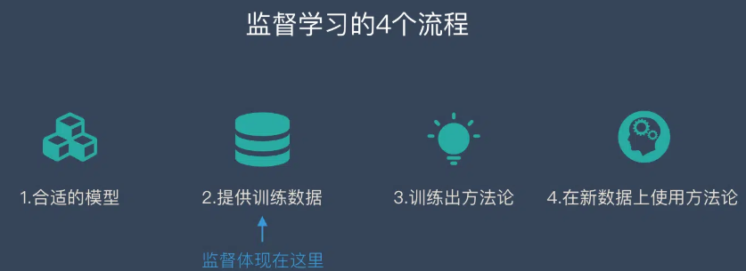
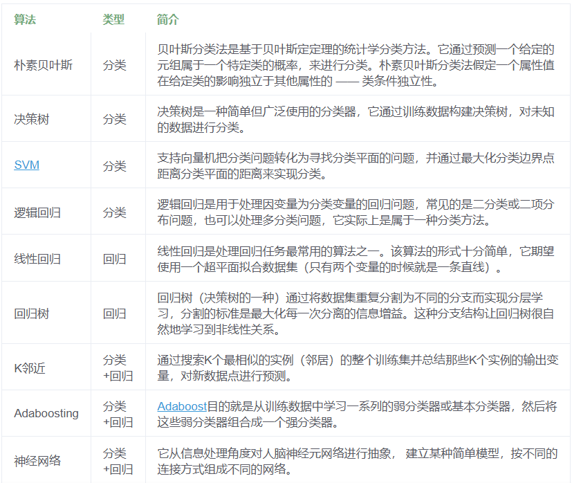
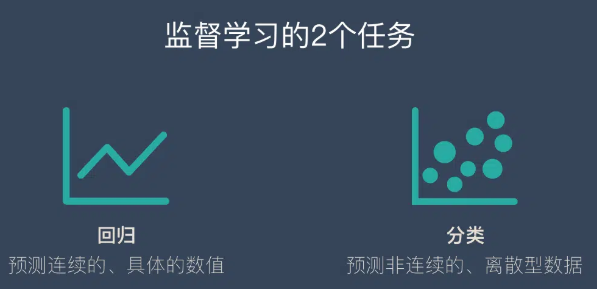
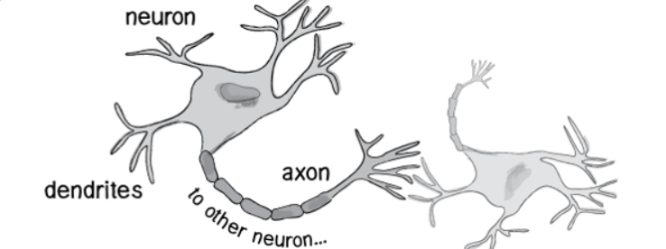
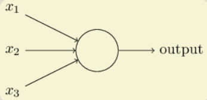
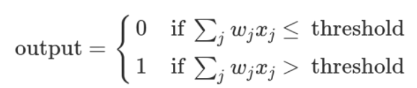
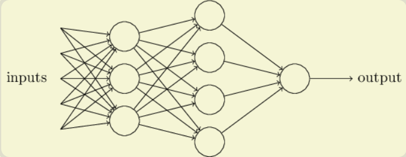

# Course 1：

## Part 1：人工智能基础常识


### 什么是监督学习？

**监督学习需要有明确的目标，很清楚自己想要什么结果**。比如：按照“既定规则”来分类、预测某个具体的值…

监督并不是指人站在机器旁边看机器做的对不对，而是下面的流程：

1. 选择一个适合目标任务的数学模型

2. 先把一部分已知的“问题和答案”（训练集）给机器去学习

3. 机器总结出了自己的“方法论”

4. 人类把”新的问题”（测试集）给机器，让他去解答

   

上面提到的问题和答案只是一个比喻，假如我们想要完成文章分类的任务，则是下面的方式：

1. 选择一个合适的数学模型
2. 把一堆已经分好类的文章和他们的分类给机器
3. 机器学会了分类的“方法论”
4. 机器学会后，再丢给他一些新的文章（不带分类），让机器预测这些文章的分类


**常见的监督学习算法**




#### 分类算法是一类监督学习算法

**监督学习**分为两大类任务

​	**回归：预测连续的、具体的数值。**

​	**分类：对各种事物分门别类，用于离散型预测。**



> 连续：
>
> 当我们说某个量是连续的，意味着它可以在一定范围内取任意值。
>
> 例如，人的身高、物体的重量或时间都是连续变量的例子，因为它们可以取无限多的值，并且两个值之间的差异可以非常小。
>
> 在数学上，如果一个变量可以在实数线上自由变动，那么这个变量就是连续的。
>
> 离散：
>
> 相对地，离散指的是那些只能取特定、分离值的数据类型。离散变量具有明确的、可数的不同状态或类别。
>
> 比如骰子的结果（1到6）、硬币投掷的结果（正面或反面），或者一个人的血型（A, B, AB, O）。


### 什么是无监督学习？

**无监督学习是一种机器学习的训练方式，它本质上是一个统计手段，在没有标签的数据里可以发现潜在的一些结构的一种训练方式。**

它主要具备3个特点：

1. 无监督学习没有明确的目的
2. 无监督学习不需要给数据打标签
3. 无监督学习无法量化效果

#### 聚类算法是一类无监督学习算法

分类算法需要事先知道“类别”个数，如果“类别”个数无从得知，如何给一堆数据分类呢？


聚类：简单说就是一种自动分类的方法，在监督学习中，你很清楚每一个分类是什么，但是聚类则不是，你并不清楚聚类后的几个分类每个代表什么意思。


**常见的无监督学习算法**


### 什么是深度学习？

#### 神经网络≈深度学习

深度学习的概念源于人工神经网络的研究，但是并不完全等于传统神经网络。

不过在叫法上，很多深度学习算法中都会包含”神经网络”这个词，比如：卷积神经网络、循环神经网络。




模拟人的大脑，造出可以思考的机器。人为什么能够思考？原因在于人体的神经网络。

>1. 外部刺激通过神经末梢，转化为电信号，转导到神经细胞（又叫神经元）。
>2. 无数神经元构成神经中枢。
>3. 神经中枢综合各种信号，做出判断。
>4. 人体根据神经中枢的指令，对外部刺激做出反应。

既然思考的基础是神经元，如果能够"人造神经元"（artificial neuron），就能组成人工神经网络，模拟思考。上个世纪六十年代，提出了最早的"人造神经元"模型，叫做["感知器"](https://zh.wikipedia.org/wiki/感知器)（perceptron），直到今天还在用。



上图的圆圈就代表一个感知器。它接受多个输入（x1，x2，x3...），产生一个输出（output），好比神经末梢感受各种外部环境的变化，最后产生电信号。

举个例子：城里正在举办一年一度的游戏动漫展览，小明拿不定主意，周末要不要去参观。他决定考虑三个因素：

> 1. 天气：周末是否晴天？
> 2. 同伴：能否找到人一起去？
> 3. 价格：门票是否可承受？

这就构成一个感知器。上面三个因素就是外部输入，最后的决定就是感知器的输出。如果三个因素都是 Yes（使用`1`表示），输出就是1（去参观）；如果都是 No（使用`0`表示），输出就是0（不去参观）。

**如果某些因素成立，另一些因素不成立，输出是什么？比如，周末是好天气，门票也不贵，但是小明找不到同伴，他还要不要去参观呢？**

现实中，各种因素很少具有同等重要性：某些因素是决定性因素，另一些因素是次要因素。因此，可以给这些因素指定权重（weight），代表它们不同的重要性。

> - 天气：权重为8
> - 同伴：权重为4
> - 价格：权重为4

上面的权重表示，天气是决定性因素，同伴和价格都是次要因素。

如果三个因素都为1，它们乘以权重的总和就是 8 + 4 + 4 = 16。如果天气和价格因素为1，同伴因素为0，总和就变为 8 + 0 + 4 = 12。

这时，还需要指定一个阈值（threshold）。如果总和大于阈值，感知器输出1，否则输出0。假定阈值为8，那么 12 > 8，小明决定去参观。阈值的高低代表了意愿的强烈，阈值越低就表示越想去，越高就越不想去。

上面的决策过程，使用数学表达如下。



上面公式中，`x`表示各种外部因素，`w`表示对应的权重。

真实世界中，实际的决策模型则要复杂得多，是由多个感知器组成的多层网络。




## Part 2：如何训练一个人工智能模型

### 2.0 神经网络的运作过程

一个神经网络的搭建，需要满足三个条件。

> - 输入和输出
> - 权重（`w`）和阈值（`b`）
> - 多层感知器的结构

也就是说需要先构建上面那个图的结构，其中，**最困难的部分就是确定权重（`w`）和阈值（`b`）。目前为止，这两个值都是主观给出的，但现实中很难估计它们的值，必需有一种方法，可以自动计算出它们**。

**:star: 试错法**：先随机初始化它们的值，控制变量法保持其他参数都不变，`w`（或`b`）的微小变动，记作`Δw`（或`Δb`），然后观察输出有什么变化。不断重复这个过程，直至得到对应最精确输出的那组`w`和`b`，就是我们要的值。这个过程称为模型的训练。

**神经网络的运作过程：**

1. **确定输入和输出**
2. **找到一种或多种算法，可以从输入得到输出**
3. **找到一组已知答案的数据集，用来训练模型，估算`w`和`b`**
4. **一旦新的数据产生，输入模型，就可以得到结果，同时对`w`和`b`进行校正**

<center><font color='blue' size=6>数据集→训练阶段→测试阶段</font></center>


### 2.1 实例-手写数字识别


* 灰度图像：其每一个像素值的范围是0~255（由纯黑色到纯白色），表示其颜色强弱程度。

* 黑白图像：每个像素值要么是0（表示纯黑色），要么是255（表示纯白色）。
* RGB图像：有三个通道，分别是红色、绿色、蓝色。每个通道的每个像素值的范围也是0~255，表示其每个像素的颜色强弱。

> 通常处理的基本都是灰度图像，因为比较好操作（值范围较小，颜色较单一），有些RGB图像在输入给神经网络之前也被转化为灰度图像，也是为了方便计算，否则三个通道的像素一起处理计算量非常大。

**第一层-输入层：将图像转换为其对应的由像素值构成的二维矩阵**

**第二层-卷积层：用来提取图像的底层特征**


卷积（convolution）是CNN的核心操作，它是一种数学操作，用于将一张图像与另一张滤波器/卷积核（kernel）进行乘积运算，从而生成一张新的图像。滤波器是一种小尺寸的矩阵，通常用于提取图像中的特定特征，每个卷积核是独立学习的，它们可以捕捉到输入图像的不同特征。。卷积操作可以帮助提取图像中的有用信息，同时减少噪声和不必要的细节。

> 卷积核个数=卷积层生成的特征图个数
>
> 较小的内核（如3x3或5x5）通常能够捕捉更精细的特征，而较大的内核可能会捕捉到更广泛但更模糊的模式。

```python
model.add(tf.keras.layers.Conv2D(filters=32, 
                                 kernel_size=(3, 3), 
                                 padding='same', 
                                 activation='relu', 
                                 input_shape=(28, 28, 3)
                          		)
         ) #添加卷积层
```

- `padding='same'`: 这个参数控制了如何处理输入的边界。当你使用 `'same'` 时，它会在输入的边缘添加适当的零填充，**以确保输出特征图的尺寸与输入尺寸相同（不考虑步幅的影响）**。如果使用 `'valid'`，则不会进行填充，输出尺寸将会减小。
- `activation='relu'`: 激活函数应用于卷积操作后的输出。ReLU（Rectified Linear Unit）函数是深度学习中最常用的激活函数之一，它的公式是 f(x)=max⁡(0,x)*f*(*x*)=max(0,*x*)，它可以引入非线性，**帮助模型学习复杂模式并缓解梯度消失问题**。
- `input_shape=(28, 28, 3)`: 这个参数定义了输入到该层的数据的形状。对于二维卷积层来说，它应该是一个三元组 `(height, width, channels)`。在这个例子中，`28, 28` 是输入图像的高度和宽度，而 `3` 表示颜色通道的数量，即这是一个RGB图像（红、绿、蓝三个通道）。**这是网络中第一个卷积层特有的参数，因为后续的卷积层可以从前一层自动推断输入形状**。

**第三层-池化层：防止过拟合，将数据维度减小**


**第四层-全连接层：汇总卷积层和池化层得到的图像的底层特征和信息**

将前一层的多为矩阵展开为一维的向量。

**第五层-输出层：根据全连接层的信息得到概率最大的结果**

通常也是一层全连接层。

```python
model = tf.keras.Sequential( )  # 创建sequential对象model 

model.add(tf.keras.layers.Conv2D(filters=32, 
                                 kernel_size=(3, 3), 
                                 padding='same', 
                                 activation='relu', 
                                 input_shape=(28, 28, 3)
                          		)
         ) #添加卷积层1 
model.add(tf.keras.layers.BatchNormalization())    #添加BN层1 

model.add(tf.keras.layers.Conv2D(filters=32, 
                                 kernel_size=(3, 3),         
                                 padding='same', 
                                 activation='relu'
                                )
         )#添加卷积层2 
model.add(tf.keras.layers.BatchNormalization( ))    #添加BN层2 

model.add(tf.keras.layers.Conv2D(filters=64, 
                                 kernel_size=(3, 3),
                                 activation='relu')
         )                     #添加卷积层3 
model.add(tf.keras.layers.BatchNormalization())     #添加BN层3 

model.add(tf.keras.layers.MaxPooling2D(pool_size=(2, 2), 
                                       strides=(2, 2)
                                      )
         )     #添加最大池化层1 

model.add(tf.keras.layers.Flatten())                #添加Flatten层 
model.add(tf.keras.layers.Dense(256,activation='relu')) #添加全连接层1
model.add(tf.keras.layers.Dropout(0.5))#添加Dropout
model.add(tf.keras.layers.Dense(50, activation='softmax')) #添加输出层
```


