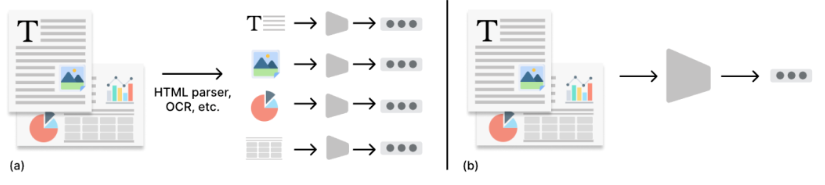

# 多模态RAG调研

## 零、为什么研究RAG

🌱为什么要研究RAG模型？

> Recently, there have been impressive advancements in large language models (LLMs) like ChatGPT (OpenAI 2022), LLaMA-2 (Touvron et al. 2023), and ChatGLM (THUDM 2023a). Although these models have shown remarkable general abilities (Bang et al. 2023; Guo et al. 2023), they still suffer severely from challenges including factual hallucination (Cao et al. 2020; Raunak, Menezes, and JunczysDowmunt 2021; Ji et al. 2023), knowledge out-dating (He, Zhang, and Roth 2022), and the lack of domain-specific expertise (Li et al. 2023c; Shen et al. 2023).

ChatGPT、LLaMA-2、ChatGLM等大模型虽然有优秀的通用能力，但是存在一些问题，①factual hallucination事实幻觉；②knowledge out-dating知识过时；③domain-specific expertise特定领域的专业知识。

> With the help of external knowledge, LLMs can generate more accurate and reliable responses. The most common method is to use a search engine as a retriever such as New Bing.

LLMs+RAG的一个典型应用就是New Bing。

> On the other hand, LLMs suffer from unreliable generation challenge. LLMs can be misled by incorrect information contained in the context (Bian et al. 2023) and also suffer from hallucination during the generation (Adlakha et al. 2023), resulting in generating content that goes beyond external information.

RAG也会给LLMs带来负面影响，比如①互联网中存在虚假信息，②LLM可能会被上下文中包含的错误信息误导，③LLM在生成过程中存在幻觉，会生成超出外部信息的内容。

> Unfortunately, currently there lacks of comprehensive understanding on how these factors can influence RAG, and how could each model survives from these drawbacks and improvement their performance via information retrieval.

**不幸的是，目前对这些因素如何影响RAG，以及每个模型如何从这些缺陷中幸存下来并通过信息检索提高其性能缺乏全面的了解。**因此，迫切需要对LLM进行全面评估，评估其有效利用检索到的信息的能力，以及抵御信息检索中存在的各种缺点的能力。

💡为了确保LLM的内部知识不会在评估结果中引入偏差，RGB选择聚合**最新的新闻信息**，并基于新闻信息构建查询。然后，基于这些查询，我们使用搜索API获取相关文档，并从内容中**选择最相关的片段作为外部检索文档**。最后，基于查询和文档集对的不同组成，我们**扩展语料库**，并将其**划分为4个测试平台**，根据RAG中常见的挑战来评估LLM的以下基本能力，如图1所示：

1. 噪声鲁棒性Noise Robustness：“从嘈杂文档中提取有用信息”的能力。

   本文中，我们将【嘈杂的文档】定义为“与问题相关的文档，但不包含任何答案信息。”

   噪声鲁棒性平台：

   ​	所有相关外部文档=噪声文档+包含答案信息的文档

   ​	噪声文档=噪声比*所有相关外部文档

2. 负拒绝Negative Rejection：“拒绝回答无答案查询”的能力

   无答案查询：所需知识不存在于任何检索到的文档中。此情况，LLM应给出“信息不足”或其他拒绝信号。

   负拒绝平台：

   ​	外部文档=噪声文档

3. 信息整合Information Integration：“回答关联多个文档的复杂问题”的能力

   信息整合平台：

   ​	查询=只能用多个文档才能回答的实例

   ​	外部文档=多个包含答案信息的文档+噪声文档

4. 反事实鲁棒性Counterfactual Robustness：“通过指令提示LLMs'警告：检索到的信息存在潜在风险‘时，能够识别检索到的文档中的已知事实错误”的能力

   反事实稳健性平台：

   ​	LLM已知的知识，即可以直接回答的query。

   ​	外部文档=存在事实错误的文档

   请注意，我们只评估 LLM 通过指令对检索到的信息中潜在风险的警告的情况。

> We found that even though RAG can improve the response accuracy of LLMs, they still suffer from the abovementioned challenges significantly. Specifically, we found that even though LLMs demonstrate some level of noise robustness, they tend to confuse similar information and frequently generate inaccurate answers when relevant information exists.

尽管RAG可以提高llm的响应精度，但它们仍然受到上述挑战的显著影响。具体来说，

1. 我们发现，尽管 LLM 展示了一定程度的噪声鲁棒性，但当相关信息存在时，它们往往会混淆相似的信息并经常生成不准确的答案。

例如，当面对有关 2022 年诺贝尔文学奖的问题时，如果有关外部文件文献中 2021 年诺贝尔奖的嘈杂文档，LLM 可能会混淆并提供不准确的答案。

2. 此外，当没有一个外部文档包含相关信息时，LLM 经常无法拒绝回答并生成不正确的答案。

3. 此外，LLM 缺乏从多个文档中总结的能力，因此如果需要多个文档来回答问题，LLM 通常无法提供准确的答案。
4. 最后，我们发现，即使llm包含所需的知识，并通过指令对检索到的信息中潜在风险的警告，它们仍然倾向于信任和优先考虑检索到的信息而不是他们自己的现有知识。

## 一、什么是多模态RAG

多模态大模型成功，让端到端（end-to-end）的算法已经成为了主流。原生多模态的RAG算法也成为了可能：**既然多模态大模型有能力理解文本，那我们其实即无需再把图像转换为文本，而可以直接使用图像，提取embedding去做RAG。**

上图是我们之前研究的传统RAG模型。

多模态RAG与传统RAG相比：

1. 检索器分两个图像检索器&文本检索器，返回的上下文也是既包含文本也包含图像。

   ① 多模态索引构建：为文本、图像、音频等数据创建索引。文本可以使用词向量，**图像可以使用卷积神经网络**提取特征，**音频可以用声学模型**编码。

   ② 检索策略：设计适合多模态数据的检索策略。例如，在图像检索中使用视觉特征比对，在文本检索中使用语义匹配。

   ③ 结果融合：将多模态检索结果进行融合，形成一个综合的查询结果。

3. 训练不同：传统RAG的LLM模型训练是先预训练后微调；多模态RAG用到的LLM模型需要对比学习训练，对比学习不同模态之间的关联性。

   ① 多模态数据对齐：将不同模态的数据（如文本与图像）配对，以便模型学习它们之间的关联。

   ② 编码器训练：训练编码器将不同模态的数据映射到共同的特征空间，便于相似性计算。

   ③ 对比学习：通过对比损失函数，优化模型在不同模态之间的相似性学习。

4. 微调方法不同：传统RAG是指令（文本）调优；多模态RAG是**视觉指令调优（Visual Instruction Tuning）**。

   ① 图像描述生成：LLM解析图像内容生成文本描述。

   ② 多模态问答：LLM根据输入的文本和图像或音频，回答相关问题。

5. 整体流程不同：

   **传统RAG系统**的实施流程通常为：检索相关文本上下文→结合LLM生成答案。

   **多模态RAG系统**需要整合多模态数据，流程如下：

   1. 多模态数据检索：根据查询从不同模态数据源中检索相关信息。
   2. 多模态上下文融合：将检索到的多模态数据整合为统一的上下文。
   3. 答案生成：LLM基于整合后的多模态上下文生成答案。

   例如，用户可以查询某产品的文本描述和图片，系统会检索相关的文本信息及图像数据，并将其融合到LLM生成的回答中。

## 二、行业应用前景

传统RAG：文档管理、知识问答等

多模态RAG：

1. 流程图→代码

   

2. 音视频流媒体→推荐/分析

   流媒体内容管理：在音视频流媒体中，结合字幕文本和视频内容生成推荐或分析。

   

3. 用户浏览过的产品图片→电商推荐

   模态特征向量化：为每种模态数据生成特征向量。

   相似性计算：在多个模态之间计算相似性。

   推荐生成：根据多模态相似性生成推荐列表。

## 三、多模态RAG有哪些解决方案

### 1. 多模态RAG

图 (a) Multimodal RAG with Multimodal Embeddings and Separate Vector Stores 的分析

- PDF Collection: 输入是PDF文档集合。
- Image Retrieval和Text Retrieval:
  - Extracted Images: 从PDF中提取图像。
  - Multimodal Embeddings: 将提取的图像转换为多模态嵌入，并存储在向量数据库中。
  - Extracted Texts: 从PDF中提取文本。
  - Text Embeddings: 将提取的文本转换为文本嵌入，并存储在向量数据库中。
- Answer Synthesis: 用户提问后，通过多模态LLM（Language Model）合成答案。

图 (b) Multimodal RAG with Image Summaries and Combined Vector Store 的架构

1. PDF Collection: 输入是PDF文档集合。
2. Image Retrieval和Text Retrieval:
   - Extracted Images: 从PDF中提取图像。
   - Multimodal LLM: 使用多模态LLM生成图像摘要。
   - Image Summaries: 图像摘要被转换为文本嵌入。
   - Text Embeddings: 提取的文本直接转换为文本嵌入。
   - Multi-Vector Retriever: 使用一个联合的向量检索器来检索图像和文本。
3. Answer Synthesis: 用户提问后，通过多模态LLM合成答案。

> https://mp.weixin.qq.com/s/n9LmqIOEtY6JX-fVDk20yg

### 2. 延迟交互编码—ColBERT

**核心思想**：延迟交互编码的核心思想是将查询和文档的编码过程分开，这样文档的编码可以离线完成，而查询的编码则在在线阶段进行。

**优点**：1.在查询时仅对查询进行编码，从而大大提高了处理速度。2.由于文档的编码是预先完成的，可以将其存储在数据库中，这样就可以对更多的文档进行排序，从而提高查询的精度。

**具体做法**：在延迟交互编码中，一个关键的计算是最大相似性（MaxSim）函数，它计算每个查询Token向量与所有文档Token向量之间的相似度，并跟踪每个查询Token的最大得分。查询和文档的总相似度分数是这些最大余弦相似度分数的总和。这种方法允许模型在保持较高排序质量的同时，也具备较高的性能。

**目前的发展前景**：随着多模态大语言模型能力的增强，以它为基础的多模态RAG，也早已突破了传统的图像检索的应用方式，而是真正具备大规模非结构化多模态数据深度理解的能力，将会有更多toB的商业应用价值。

### 3. ColPali

该方法利用了Google团队的视觉语言模型 (VLM) **PaliGemma**，它将整个文档页面编码为**嵌入向量，将页面布局和视觉元素视为检索过程的一部分**。ColPali RAG使用受ColBERT（Column BERT）启发的后期交互机制，通过启用用户查询和文档patches之间的token-level匹配来增强检索。这种方法确保了高检索准确性，同时还保持了合理的索引和查询速度。它对于富含视觉效果的文档特别有益，例如信息图表、表格和复杂布局，而传统的基于文本的检索方法很难处理这些文档。

上面是传统的建索引和检索过程，可以看出要进行一系列的pdf parse过程。最后得到文本chunking，然后送入文本向量模型中，得到向量；下面是ColPali的建索引和检索过程，直接输入整个页面的截图进入Vision LLM中，得到多个向量。

**核心思想**：与 ColBERT 相比，ColPali 仍然使用文本作为查询，文档则是图像类型。在视觉encoder，也是利用多模态的视觉大模型来生成图片端的向量，但不仅仅只生成单个向量。而是利用VIT的patch embedding，来生成多个向量。直觉上确实是会有收益，因为一整页的pdf，只压缩在一个固定维度的向量中，那肯定有信息损失，而且以patch为单位生成embedding。

**优点**：直接对文档用视觉模型解析。

**具体做法**：ColPali选择**PaliGemma-3B**作为其视觉语言模型，为了生成轻量级的多向量表示，ColPali<u>在PaliGemma-3B模型的基础上添加了一个投影层</u>，将输出的语言建模嵌入映射到一个降低维度的向量空间中（D=128），（这与ColBERT论文中使用的向量空间大小相同）。ColPali采用了和ColBERT 类似的<u>后期交互机制</u>，通过这种方式，ColPali能够在检索时充分利用查询和文档之间的交互，同时保持了离线计算和快速查询匹配的优势。在ColPali模型中，<u>对比损失用于优化检索任务</u>，使得模型能够学习区分与查询相关的文档和不相关的文档。

> **PaliGemma-3B**作为其视觉语言模型，这是一个相对较小的模型，具有多个针对不同图像分辨率和任务微调的检查点，并且在各种文档理解基准测试中表现出色。PaliGemma-3B的一个关键特性是其文本模型在前缀（指令文本和图像标记）上进行了全块注意力的微调。

> 在ColPali模型的训练过程中，每个批次包含多个查询-文档对。对于每对查询$q_k$和其对应的正样本文档$d_k$，模型会计算一个正样本分数$s_k^+$，这是通过后期交互操作$LI(q_k,d_k)$得到的。同时，模型还会计算一个负样本分数$s_k^-$，这是通过在批次中所有其他文档（即负样本）上执行晚期交互操作，并取最大值得到的。
> $$
> L =\frac{1}{b}\sum^{b}_{k=1}softplus(s_k^--s_k^+)
> $$
> 其中：
>
> -  b是批次中查询-文档对的数量。
> -  是查询$q_k$与其对应的正样本文档dk之间的正样本分数。
> - 是查询$q_k$与所有负样本文档中的最大分数。

实验效果：

横轴：

- **ArxivQ**: Arxiv问答任务的表现。
- **DocQ**: 文档问答任务的表现。
- **InfoQ**: 信息检索问答任务的表现。
- **TabF**: 表格填充任务的表现。
- **TATQ**: 图像文本问答任务的表现。
- **Shift**: 数据集偏移适应能力。
- **AI**: AI相关问题的回答能力。
- **Energy**: 能源相关问题的回答能力。
- **Gov.**: 政府相关问题的回答能力。
- **Health.**: 健康相关问题的回答能力。
- **Avg.**: 所有任务的平均表现。

纵轴：是不同方法的对比，包括

1. 非结构化模型（仅针对文本）
2. 非结构化模型（使用了OCR模块）
3. 非结构化模型（结合图像描述生成技术处理非结构化文本和图像信息。）

以上三种模型的检索器中使用的嵌入模型是BM25/BGE-M3。

**对比学习视觉语言模型**

​	此类模型的检索器中使用的嵌入模型是Jina-CLIP/Nomic-vision/SigLIP（原生）

**本文模型**

​	此类模型的检索器中使用的嵌入模型是SigLIP（原生）/BiSigLIP（微调）/BiPali（LLM）/ColPali（延迟交互）

**实验结果分析**

- **BM25** 和 **BGE-M3** 在只使用文本信息时表现一般。
- **结合OCR和Captioning技术** 后，模型在多个任务上的表现都有显著提升。
- **对比学习的视觉语言模型** 在某些任务上表现不佳，但在特定任务上有一定优势。
- **提出的模型**（如ColPali）在所有任务上的表现都优于基线模型，特别是在AI、能源、政府和健康相关问题的回答上表现尤为突出。

**Reference：**

​	ColPali: Efficient Document Retrieval with Vision Language Models

​	https://github.com/illuin-tech/colpali?tab=readme-ov-file

​	ColPali论文: https://arxiv.org/abs/2407.01449
​	ColPali博客: https://huggingface.co/blog/manu/colpali
​	ColPali实战: https://github.com/weaviate/recipes/blob/main/weaviate-features/named-vectors/NamedVectors-ColPali-POC.ipynb

### 4. 混合ColPali RAG

混合ColPali RAG 结合了图像嵌入和ColPali的后期交互机制的优势，进一步提高了检索性能。

- 系统首先使用图像嵌入（例如来自 JinaCLIP 等模型）执行粗略检索步骤，以检索前 k 个相关文档页面。
- 然后，在第二遍中，系统使用 ColPali 后期交互机制对这 k 个页面重新排序，以根据视觉和文本信息确定最终最相关的页面集。

当文档包含复杂的视觉效果和详细的文本时，这种混合方法特别有用，允许系统利用这两种内容类型进行高度准确的文档检索。

## 四、如何评估多模态RAG模型

### 1.端到端评估—EvalScope

将**用户输入、检索上下文、模型输出和标准答案(可选)**这四部分输入给法官大模型，模型将根据给定的指标评估整个RAG生成的效果。

EvalScope支持RAG和多模态RAG的独立评估和端到端评估：

- **端到端评估：**评估RAG模型对给定输入生成的输出内容，包括模型生成答案与输入查询的相关性和对齐程度。从内容生成目标视角来评估可以将评估划分为**无参考答案**和**有参考答案**：无参考答案评估指标包括**上下文相关性**(Context Relevance)、**忠实度**(Faithfulness) 等；而有参考答案评估指标包括**正确性**(Answer Correctness)、**BLEU、ROUGE**等。

> EvalEcope基于Ragas

#### 忠实度

衡量模型输出与检索上下文中的事实一致性。如果**答案中所有的陈述**都可以从**检索上下文**中推断出来，则认为生成的答案是忠实的。
答案的得分范围为 (0,1)，得分越高表示忠实度越好。

示例：

**用户输入:** 特斯拉 Model X 怎么样？

**检索上下文:**

一张特斯拉 Model X 的图片

**高忠实度输出:** 特斯拉 Model X 是一款由特斯拉制造的电动SUV。

**低忠实度输出:** 猫很可爱。

解释："猫很可爱" 无法从特斯拉 Model X 的图片中推断出来，因此忠实度得分为 0。

#### 相关度

标衡量模型输出与检索上下文以及用户输入的**相关性**。答案的得分范围为 (0,1)，得分越高表示相关性越好。

示例：

**用户输入:** 这幅画是谁画的？

**检索上下文:**

- 一幅毕加索的画

  

**高相关性输出:** 这幅画是毕加索画的。

**低相关性输出:** 这是一幅美丽的画。

解释："这是一幅美丽的画" 虽然描述了画的特性，但没有回答问题，因此相关性得分为 0。

#### 正确性

评估涉及将模型输出与标准答案进行比对，以衡量其准确性。评分范围从0到1，分数越高，表示生成的回答与标准答案的匹配度越高，正确性更好。**该指标不涉及图像模态。**

示例：

**用户输入:** 爱因斯坦什么时候出生？

**标准答案：**爱因斯坦于1879年在德国出生。

**高正确性回答：**爱因斯坦于1879年在德国出生。

**低正确性回答：**爱因斯坦于1879年在西班牙出生。

解释：
将标准答案和回答拆分成事实子句，并使用以下概念进行计算：

- TP（True Positive）：在标准答案和生成的回答中都存在的事实或陈述。
- FP（False Positive）：存在于生成的回答中但不存在于标准答案中的事实或陈述。
- FN（False Negative）：存在于标准答案中但不存在于生成的回答中的事实或陈述。

在该例子中：
- TP: [爱因斯坦于1879年出生]
- FP: [爱因斯坦于西班牙出生]
- FN: [爱因斯坦于德国出生]

计算公式：
$$
F1 score = \frac{|TP|}{(|TP|+{0.5}\times{(|TP|+|FN|)})}
$$
因此，低正确性回答的F1 score为0.5，而高正确性回答的F1为1。

> 更多常见评估指标可参考EvalScope使用指南:https://evalscope.readthedocs.io/zh-cn/latest/user_guides/backend/rageval_backend/ragas.html#id5

### 2. 独立评估—CLIP Benchmark

也是EvalScope所支持的：https://evalscope.readthedocs.io/zh-cn/latest/user_guides/backend/rageval_backend/clip_benchmark.html#clip-benchmark，提供自定义图文检索评估支持。

* **独立评估：**单独评估检索模块，评估指标包括指标包括 **命中率(Hit Rate)**、**平均排名倒数**(Mean Reciprocal Rank, MRR)、**归一化折扣累积增益**(Normalized Discounted Cumulative Gain, NDCG)、**准确率**(Precision) 等，这些指标用于测量系统在根据查询或任务排名项目方面的有效性。

## 五、研究思路（v1.0）

在已有的训练好的多模态RAG模型基础上使用微调技术得到新模型，然后使用EvalScope评测。

**Baseline**：因此，首先需要先跑通ColPali的VLMs模型组合（即Qwen等Base模型作为LLM模型、ViTs模型作为视觉模型）在EvalScope上的实验。

**Experiment1**：提出创新点，实现代码。

