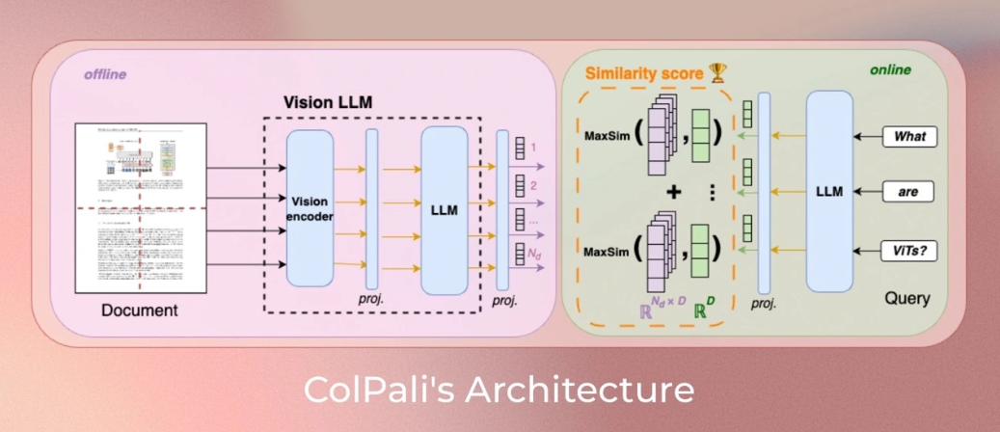
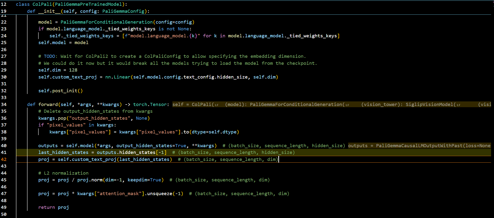
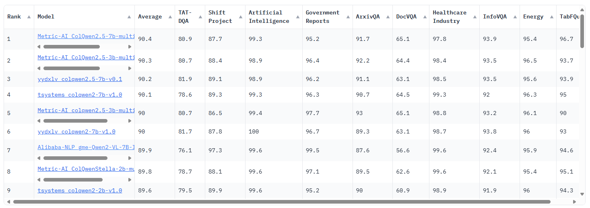
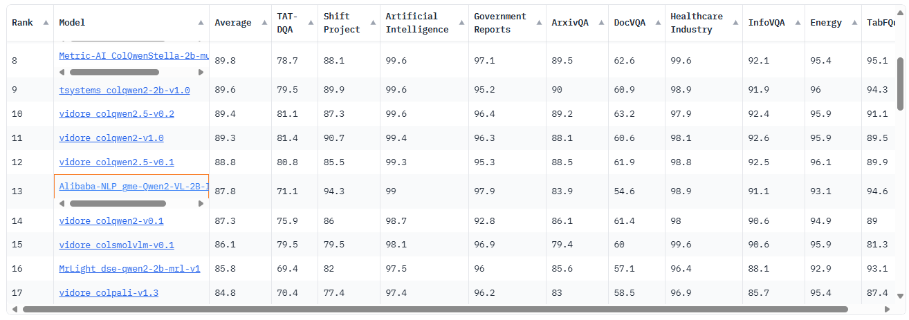
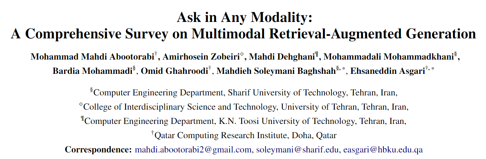
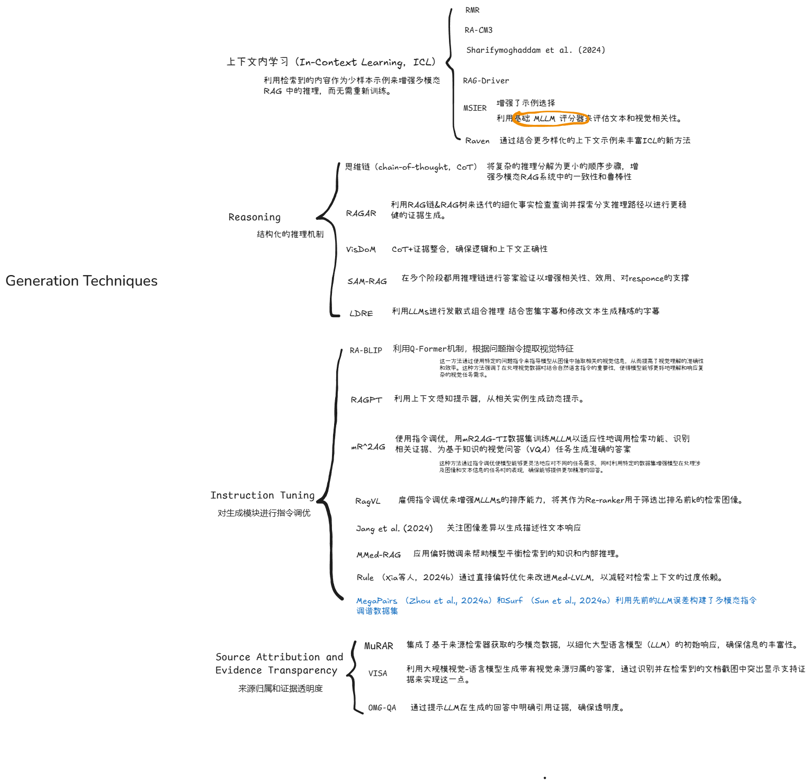

# 多模态实验过程记录


## 实验1：colpaligemma-3b-pt-448-base测试



```json
PaliGemmaForConditionalGeneration(
  (vision_tower): SiglipVisionModel(
    (vision_model): SiglipVisionTransformer(
      (embeddings): SiglipVisionEmbeddings(
        (patch_embedding): Conv2d(3, 1152, kernel_size=(14, 14), stride=(14, 14), padding=valid)
        (position_embedding): Embedding(1024, 1152)
      )
      (encoder): SiglipEncoder(
        (layers): ModuleList(
          (0-26): 27 x SiglipEncoderLayer(
            (self_attn): SiglipSdpaAttention(
              (k_proj): Linear(in_features=1152, out_features=1152, bias=True)
              (v_proj): Linear(in_features=1152, out_features=1152, bias=True)
              (q_proj): Linear(in_features=1152, out_features=1152, bias=True)
              (out_proj): Linear(in_features=1152, out_features=1152, bias=True)
            )
            (layer_norm1): LayerNorm((1152,), eps=1e-06, elementwise_affine=True)
            (mlp): SiglipMLP(
              (activation_fn): PytorchGELUTanh()
              (fc1): Linear(in_features=1152, out_features=4304, bias=True)
              (fc2): Linear(in_features=4304, out_features=1152, bias=True)
            )
            (layer_norm2): LayerNorm((1152,), eps=1e-06, elementwise_affine=True)
          )
        )
      )
      (post_layernorm): LayerNorm((1152,), eps=1e-06, elementwise_affine=True)
    )
  )
  (multi_modal_projector): PaliGemmaMultiModalProjector(
    (linear): Linear(in_features=1152, out_features=2048, bias=True)
  )
  (language_model): GemmaForCausalLM(
    (model): GemmaModel(
      (embed_tokens): Embedding(257216, 2048, padding_idx=0)
      (layers): ModuleList(
        (0-17): 18 x GemmaDecoderLayer(
          (self_attn): GemmaAttention(
            (q_proj): Linear(in_features=2048, out_features=2048, bias=False)
            (k_proj): Linear(in_features=2048, out_features=256, bias=False)
            (v_proj): Linear(in_features=2048, out_features=256, bias=False)
            (o_proj): Linear(in_features=2048, out_features=2048, bias=False)
          )
          (mlp): GemmaMLP(
            (gate_proj): Linear(in_features=2048, out_features=16384, bias=False)
            (up_proj): Linear(in_features=2048, out_features=16384, bias=False)
            (down_proj): Linear(in_features=16384, out_features=2048, bias=False)
            (act_fn): PytorchGELUTanh()
          )
          (input_layernorm): GemmaRMSNorm((2048,), eps=1e-06)
          (post_attention_layernorm): GemmaRMSNorm((2048,), eps=1e-06)
        )
      )
      (norm): GemmaRMSNorm((2048,), eps=1e-06)
      (rotary_emb): GemmaRotaryEmbedding()
    )
    (lm_head): Linear(in_features=2048, out_features=257216, bias=False)
  )
)
```


**图中左侧的Vision LLM**：PaliGemma-3B 是一种视觉-语言模型（VLM），该模型使用的ViTs模型是SigLIP-So400m/14，它可以生成高质量的图像嵌入。

**1》**processor = **AutoProcessor**.from_pretrained(model_name)

inputs = processor(images=image, text=prompt,  return_tensors="pt")

> inputs['input_ids'].shape = torch.Size([1, 1034])
>
> inputs['attention_mask'].shape = torch.Size([1, 1034])
>
> inputs['pixel_values'].shape = torch.Size([1, 3, 448, 448])

**2》**batch_images = **ColPaliProcessor**.process_images(RGB图像列表)

> batch_images = processor.process_images(images).to(model.device)
>
> batch_queries = processor.process_queries(queries).to(model.device)
>
> 
>
> batch_images ['input_ids'].shape = torch.Size([2, 1030])
>
> batch_images ['attention_mask'].shape = torch.Size([1, 1030])
>
> batch_images ['pixel_values'].shape = torch.Size([2, 3, 448, 448])
>
> 
>
> batch_queries['input_ids'].shape = torch.Size([2, 27])
>
> batch_queries['attention_mask'].shape = torch.Size([2, 27])


image_embeddings = model(**batch_images) # with torch.no_grad():



proj就是一层用于降维的线性层。


**图中右侧的LLM：**该模型使用的LLMs模型是Gemma-2B。一个特别有趣的特性是，PaliGemma-3B 的文本模型是通过带有前缀（指令文本和图像标记）的全块注意力机制进行微调的。

batch_queries = **ColPaliProcessor**.process_queries(文本句子列表)

query_embeddings = model(**batch_queries) # with torch.no_grad():


**应用：**

scores = **ColPaliProcessor**.score_multi_vector(query_embeddings, image_embeddings)


## Base模型选择

### （1）

**Metric-AI/ColQwen2.5-3b-multilingual-v1.0**

1. Vidore榜单排名第2

   

2. 是lora微调后的模型

> 是否能把lora微调后的和没有lora微调的模型放在一起对比？

3. 这是一个多语言模型

**Alibaba-NLP/gme-Qwen2-VL-2B-Instruct**

1. Vidore榜单排名第13



2. 原模型

> 排名靠前的都是lora微调后的模型，就这一个阿里的不是


### （2）多模态综述

2025年2月的



#### 4.4 Generation Techniques



#### 6.3 Agent-Based and Self-Guided Systems

将强化学习和端到端与人一致的反馈结合到多模态rag中，在很大程度上仍未被探索，但在增强这些系统方面具有巨大的潜力。


## Idea

由于计算资源有限，就在别人训练好的模型（比如Qwen2-VL）的基础上用DQN/PPO微调，强化学习用的数据集就是DocVQA这种常见的多模态测试数据集，DocVQA数据集中的标准答案就当作是反馈（如果MLLM生成的responce和这个答案一致就点赞，否则就纠正），query就是查询，image就是图像。

### 可行性分析

1. **基础模型选择**：选择一个性能优越的预训练模型作为起点，可以大大减少所需的计算资源，并缩短开发周期。Qwen2-VL这样的多模态模型能够很好地理解文本和图像信息，为后续的任务提供了坚实的基础。
2. **数据集选择**：DocVQA是一个非常适合用于此目的的数据集，它包含了大量文档图像及其对应的问题与答案，有助于训练模型准确理解和回答基于图像的问题。
3. **反馈机制设计**：将DocVQA中的标准答案用作反馈信号，通过比较生成的回答与标准答案的一致性来提供奖励（点赞或纠正），这种方法直观有效。这不仅简化了奖励函数的设计，还确保了反馈的质量。

### 实施建议

1. **环境设置**：
   - **状态空间**：定义状态空间为当前查询、图像以及模型生成的回答。
   - **动作空间**：动作空间可以是模型参数的调整方向和幅度，或者是直接对回答进行修正的选择。
2. **强化学习算法选择**：
   - **PPO**可能更适合这种场景，因为它在处理高维状态和动作空间时表现良好，并且能更稳定地更新策略，避免了DQN中可能出现的过估计问题。
3. **奖励设计**：
   - 除了简单的“点赞/纠正”之外，还可以考虑引入部分奖励机制，即即使回答不完全正确，但如果包含了正确的关键信息，也可以给予一定的正向激励。
   - 对于纠正的情况，可以尝试给出具体的修改建议，而不是仅仅标记为错误，这样可以帮助模型更快地学习到正确的模式。
4. **实验与评估**：
   - 在开始全面训练之前，先在一个较小规模的数据子集上进行初步实验，以验证整个框架的有效性。
   - 使用交叉验证等技术评估模型性能，确保改进措施确实提升了模型的整体表现。
5. **持续优化**：
   - 根据实验结果不断调整强化学习策略和参数设置，逐步逼近最优解。
   - 考虑引入用户实际交互数据，进一步丰富训练样本，提升模型的实际应用效果。