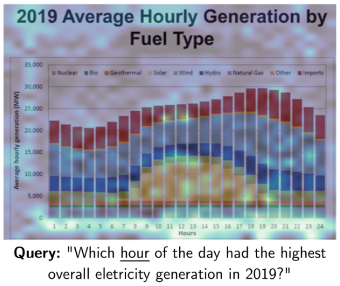
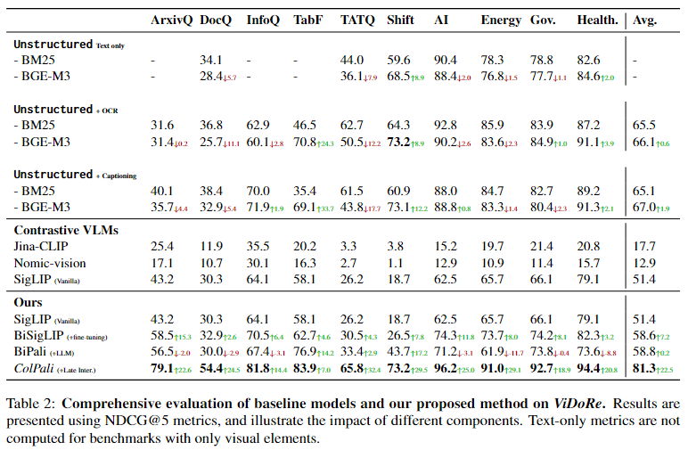
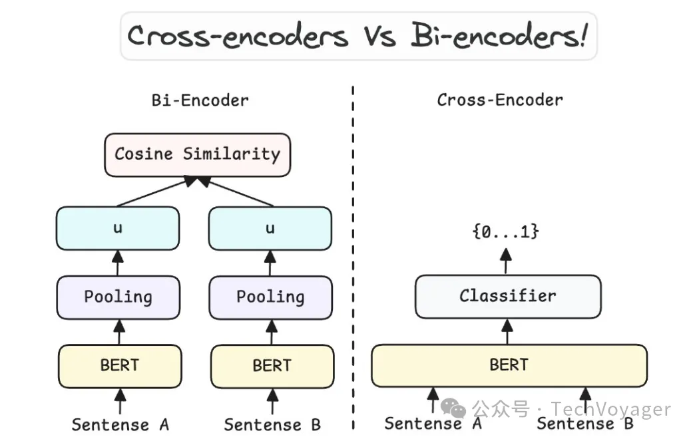
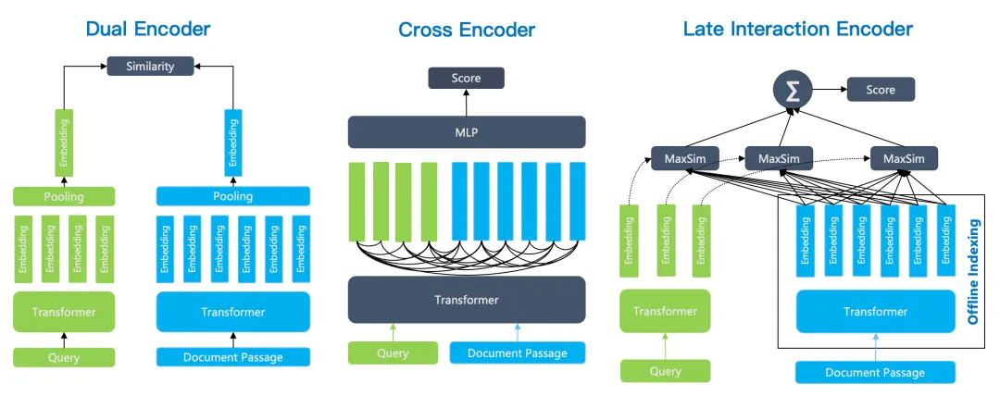

# ColPali: Efficient Document Retrieval with Vision Language Models

## 摘要

本文针对的研究领域是“视觉丰富的文档检索系统”，本文对这个领域进行了基准测试进而提出了**视觉文档检索基准ViDoRe**。

>  ViDoRe由跨越多个领域、语言和设置的各种页面级检索任务组成。

本文提出了新的检索模型架构ColPali，核心思想是**利用CV模型的文档理解能力从“文档页面的图像”生成高质量的上下文嵌入**，再结合后期交互匹配机制（即 延迟交互编码 技术），大大优化了端到端多模态文档检索任务的速度。

总结，本文主要两个贡献：

1. 提出了视觉文档检索Benchmark——ViDoRe
2. 提出了新的端到端多模态文档检索架构——ColPali

## Introduction

首图：

案例：

​	Query：“Which <u>hour</u> of the day had the highest overall eletricity generation in 2019？”（2019年平均每天24小时的发电量中<u>哪个小时</u>产量最高？）

​	Image：图片中可以看出横纵坐标轴、标题、波动曲线都被高亮了

图1图注：

​	对于用户查询中的每一个term（词），ColPali 识别最相关的文档图像块（突出显示的区域），并计算query-to-page的匹配分数。然后，从大型预索引语料库中快速检索最相关的文档。

> ？query中每一个词都去识别图像中与之相关的图像块吗？用的什么模型，准确率多高？
>
> ？query-to-page的匹配分数=？\sum每个词与最相关的图像块的相似值

对于PDF文档的识别建索引的传统步骤：

1. `PDF解析器`/`OCR（Optical Character Recognition光学字符识别）系统`从页面中提取词语
2. `文档布局检测模型`分割段落、标题和其他页面对象，例如表、图形和标题。
3. 定义一个`分块策略`，对具有某种语义连贯性的文本段落进行分组
4. 最新的`检索设置`还使用了`captioning step（集成步骤）`，就是额外做一步以图生文，生成一个对图像的描述反过来增强模型对图像的理解。

本研究的动机是从Table 2这个实验中发现了优化the ingestion pipeline摄取管道在视觉丰富的文档检索上比优化文本嵌入模型能取得更大的性能提升。

横轴：疑似是数据集

纵轴：是不同方法的对比，包括

			1. 非结构化模型（仅针对文本）
   			2. 非结构化模型（使用了OCR模块）
            			3. 非结构化模型（使用了继承步骤）

以上三种模型的检索器中使用的嵌入模型是BM25/BGE-M3。

   			1. 对比学习视觉语言模型

此类模型的检索器中使用的嵌入模型是Jina-CLIP/Nomic-vision/SigLIP（原生）

   			1. 本文模型

此类模型的检索器中使用的嵌入模型是SigLIP（原生）/BiSigLIP（微调）/BiPali（LLM）/ColPali（延迟交互）

Contribution 1—**ViDoRe**：

在这项工作中，我们认为不应仅根据文本嵌入模型的能力来评估文档检索系统，也需要考虑到文档检索中的上下文（文本）和视觉元素。

换句话说，一个好的文档检索系统不仅要能理解文字内容，还要能够：

- **理解上下文**：考虑到文档的整体背景和语境，而不仅仅是单独的句子或关键词。
- **处理视觉信息**：识别并理解文档中的图片、图表、表格等非文本元素，并且知道这些元素与文本内容的关系。

举个例子，如果你在搜索一篇关于“气候变化”的科学报告，理想的检索系统不仅应该能找到包含相关文字描述的文档，还应该能识别出那些含有重要图表或图片的文档，这些图表或图片可能展示了关键的数据趋势或案例研究，对理解文档内容非常重要。

Contribution 2—**ColPali**：

ColPali可以纯粹根据文档的视觉特征有效地对其进行索引，从而允许后续与后期交互机制进行快速查询匹配。

## 问题定义与相关工作（Problem Formulation & Related Work）

### 1. 问题定义

在本文的设定中，检索系统会对语料库 D中的文档 d 与查询 q的相关性进行评分。预先对语料库中每个文档计算其与query的分数s(q,d)，所有这些分数组成一个集合R，并且按照相关性从高到低排名（索引）。

> 跟传统RAG一样

本研究中重点关注**页面级检索**：给定一个query，系统能否检索出正确的页面？

本研究中的term==document。

另外，本研究还对评分系统的延迟设置了限制要求。（这主要是为了模拟实际工业场景的需求）

大部分当前的检索系统可以分解为

（1）离线索引构建：一个document一个index

（2）在线查询阶段：从离线索引库中低延迟的迅速匹配一个query对应的document

一个好的文档检索系统需要**3R特点**：

R1（retrieval performance）：高检索性能

R2（low latency）：检索时低性能

R3（high throughput）：索引期间高吞吐量

### 2. 文本检索方法

检索策略：BM25、密集检索（**Bi-Encoder、Cross-Encoder**）、混合检索、重排序

本文只讨论密集检索

- **双编码器（Bi-Encoder/Dual Encoder）**：
  - 文档在离线阶段被转换成密集向量。
  - 查询在线转换成向量后，使用快速的余弦相似度计算来找到最接近的文档向量。
  - 这种方法计算速度快，适合处理大规模数据集。
- **交叉编码器（Cross-Encoder）**：
  - 查询和文档被组合成单一序列，然后一起编码。
  - 对于每一对查询和文档，都会计算它们之间的匹配分数，允许更精细的上下文理解。
  - 虽然这种方法稍微更精确，但由于需要对每个查询文档对都进行编码，因此计算成本更高，效率较低。

* **延迟交互检索**

  

  * **双编码器**：查询和文档分别编码后直接进行相似度计算。

  * **交叉编码器**：查询和文档组合成一个序列，一起编码，然后进行匹配。

  * **延迟交互编码**：查询和文档分别编码后，通过后期交互机制（如MaxSim）进行更复杂的相似度计算。
    $$
    \text{Score} = \text{MaxSim}(\text{Attention}(\mathbf{q} \oplus \mathbf{d})) 
    $$

在工业界使用这些模型时，很多性能上的提升并不是来自于模型本身变得更好，而是因为前期的数据准备做得更加充分。换句话说，如果喂给模型的数据质量更高、更合适，那么即使模型没有变化，它的表现也会更好。

此外，当人们阅读文档时，往往依赖于其中的图片、表格、图表等视觉元素来更快地理解信息。但是，大多数基于文本的系统（比如搜索引擎或聊天机器人）在处理信息时，只能看到纯文本内容，而忽略了那些对人类读者非常有帮助的视觉线索。

综上，虽然我们有各种方法来评估文本嵌入模型，但真正影响它们在实际应用中表现的关键因素之一是前期如何准备和处理数据。同时，现有的文本系统还没有充分利用到文档中丰富的视觉信息，而这部分信息对于提高理解和交互效果是非常重要的。

**这是第一个基准——通过考虑像人类这样的文本和视觉文档特征来评估文档检索方法。**

### 3. 整合视觉特征

* **基于对比学习来训练理解文本和图片之间关联的模型**

  一个编码器理解文本，另一个图像编码器专门理解图片，通过改写损失函数（对比损失contrastive losses）来联合训练。

* **用OCR执行光学字符识别**

  可以识别图像中的文本，但视觉部分通常不是专门为理解文本设计的。这意味着，尽管模型可以识别出图像中的单词或句子，但它可能不会像专门的文本理解系统那样深入地理解这些文本的意义。

* **基于细粒度交互的预训练模型**

  为了解决上述问题，Yao 等人（2021 年）提出了细粒度交互语言-图像预训练（Finegrained Interactive Language-Image Pre-training, FILIP）框架。具体来说，它依赖于最大相似度操作（max similarity operations），即计算文本中的**每个词（token）**与图像中的**小块区域（patch）**之间的最大相似度得分。模型可以更细致地捕捉文本和图像之间的对应关系，从而更好地理解两者之间的联系。